# Demo Walkthrough & Interactive Simulation Flow: Penang, Malaysia Edition

This document details the step-by-step narrative, state transitions, visual specifications, and background simulation architecture for the **WanderSync** demo, set in **Penang, Malaysia**.

Rather than presenting a static, pre-canned schedule, the demo showcases a **living, collaborative travel OS** featuring:
1. **Dynamic Genesis**: Dual entry paths (AI Questionnaire ➔ true zero-state vs. Social Reel Import ➔ extracted Penang anchors with gap opportunities & flexible date range).
2. **Ambient Multi-User Collaboration**: Background chat banter and parallel itinerary population for Days 2 & 3, running on autonomous timers.
3. **Ghost "Proposed" vs Solid "Confirmed" Lifecycles**: Frosted glass ghost cards with direct `[✓ Confirm]` and `[🗳 Vote]` actions.
4. **Anti-Slop AI Intelligence**: Clean Apple iOS 26-style schedule advisories (Monday street vendor closures, cash-only Hawker requirements, peak queue warnings) with zero rainbow glitter.
5. **Live Day HUD & 3-Way Contingency**: Real-time departure HUD with instant tropical rain resolution (`Indoor Fallback` vs. `Free-Time Pocket` vs. `Reflow`).
6. **Zero-Lag Headless Controller (`/remote`)**: Independent control surface synchronizing via browser `BroadcastChannel`.

---

## 1. End-to-End Demo Sequence (Mermaid Architecture)

```mermaid
flowchart TD
    %% Phase 1: Dynamic Genesis
    subgraph Act1 ["Act 1: Dynamic Genesis & Reel Extraction"]
        A["User opens WanderSync<br>(Clean Onboarding Modal)"] --> B{"Choose Genesis Path"}
        B -- "Path A: AI Preferences" --> C1["Zero-State Skeleton<br>(Clean slate waiting for team)"]
        B -- "Path B: Import Social Reel" --> C2["Paste IG Reel URL<br>(@penangfoodie: Hidden Heritage & Penang Hill)"]
        C2 --> D["Configure Trip Dates<br>• Custom Date Range: Oct 12 – Oct 14 (3 Days)<br>• Reorder / Drag Extracted Anchors"]
        D --> E["Initialize 3-Day Penang Itinerary<br>• Day 1: 2 Extracted Reel Anchors placed<br>• Dotted 'AI Gap Opportunity' between them"]
    end

    %% Phase 2: Ambient Influx & Whiteboard
    subgraph Act2 ["Act 2: Ambient Influx & Idea Whiteboard"]
        E --> F["Ambient Background Engine Starts<br>• Days 2 & 3 begin populating quietly in parallel<br>• Subtle '●' activity dot appears on Day 2 tab"]
        F --> G["Presenter visits 'Ideas & Whiteboard'<br>• Tactile Sticky Notes & Team Wishlist<br>• User adds custom note: 'Beach Sunset at Batu Ferringhi'<br>• 1-Tap 'Promote to Day 1'"]
    end

    %% Phase 3: Conversational Intelligence
    subgraph Act3 ["Act 3: Conversational AI & Proposed Ghost Card"]
        G --> H["Presenter switches to 'Activity Chat'<br>(Contextual Thread for Day 1)"]
        H --> I["Autonomous Incoming Chat<br>Tony: 'What are we eating between Chew Jetty & Penang Hill?'"]
        I --> J["WanderBot In-Thread Extraction<br>'🤖 Lunch gap detected: Propose Lebuh Keng Kwee Teochew Chendul & Char Koay Teow?'"]
        J --> K["1-Tap Insert to Timeline<br>Ghost Card placed on Day 1 (Proposed status)"]
    end

    %% Act 4: Consensus & Life Cycle
    subgraph Act4 ["Act 4: Consensus & Schedule Intelligence"]
        K --> L["Timeline displays Dashed Ghost Card<br>Shows [✓ Confirm] and [🗳 Put to Vote]"]
        L --> M["Launch Group Mini-Poll<br>Tony & Wei Gang vote via ambient timer (100% consensus)"]
        M --> N["Ghost Card morphs to Confirmed Solid<br>GrabCar / Rapid Penang transit buffers calculate automatically"]
        N --> O["AI Schedule Advisory (Anti-Slop)<br>• Warning: Siam Road Char Koay Teow closed on Mondays<br>• 1-Tap 'Shift to Day 3' spring reorder animation"]
    end

    %% Act 5: Live HUD & Contingency
    subgraph Act5 ["Act 5: Live HUD & 3-Way Contingency"]
        O --> P["Switch to 'Live Day HUD Mode'<br>(Minimal Now/Next HUD + Grab Booking / Pass)"]
        P --> Q["Remote triggers Contingency Event<br>(Afternoon Tropical Monsoon Rain at Penang Hill)"]
        Q --> R{"3-Way Contingency Resolution"}
        R -- "Option 1" --> S1["Switch to Indoor Fallback<br>(The Top Komtar Indoor Theme Park & Rainbow Skywalk)"]
        R -- "Option 2" --> S2["Hold Free-Time Pocket<br>(Relax at ChinaHouse Cafe without shifting dinner)"]
        R -- "Option 3" --> S3["Chronological Reflow<br>(1-tap push/pull schedule)"]
    end

    Act1 --> Act2 --> Act3 --> Act4 --> Act5
```



---

## 2. Detailed 3-Day Scope & Responsibilities (Penang Edition)

| Day | Destination Focus | How It Populates | Purpose in Pitch |
| :--- | :--- | :--- | :--- |
| **Day 1 (George Town Heritage & Penang Hill)** | **Active Working Canvas** | Live interactive creation: Reel Import ➔ Chendul Gap Fill ➔ Group Chat ➔ Polling ➔ Live HUD | The hero focus of your live talk. Shows every feature being touched in real time. |
| **Day 2 (Batu Ferringhi & Balik Pulau)** | **Autonomous Background Collaborator** | Starts empty; auto-populates on a 4–6s staggered background loop as Tony & Wei Gang "add" spots (Entopia Butterfly Farm, Escape Theme Park, Durian Orchards) | Proves multi-user realtime collaboration without slowing down the presenter. Tapping Day 2 reveals live cards & votes. |
| **Day 3 (Street Art & Hawker Fare)** | **Pre-Seeded / AI Optimized** | Receives relocated activities (e.g. Siam Road CKT shifted from Day 1 due to Monday closure) and Armenian Street bicycle tour | Proves cross-day reflow and vendor schedule conflict resolution. |

---

## 3. Screen-by-Screen Walkthrough Narrative

### Act 1: Dynamic Genesis & Social Reel Import
- **Screen**: Welcome / Onboarding Modal
- **What Happens**:
  1. The presenter clicks **"Import from Social Reels"**.
  2. The modal scans the sample IG Reel (`@penangfoodie: 5 Must-Visit Heritage Spots & Sunset Lookouts`).
  3. **Date & Duration Customizer**:
     - Defaults to a **3-Day Trip** (`Oct 12 – Oct 14`) with quick selector pills: `[Weekend (3D)]`, `[4 Days]`, `[5 Days]`.
     - Date inputs allow direct calendar picking.
  4. **Draggable Extracted Cards**:
     - Detected venues appear with vertical drag handles:
       - 📍 *Clan Jetties (Chew Jetty) Morning Heritage Walk* (`[Day 1 ▾]`)
       - 📍 *Penang Hill Funicular & The Habitat Sunset Canopy Walk* (`[Day 1 ▾]`)
     - Presenter drags them to set the desired order, then taps **"Build Itinerary"**.
  5. **Timeline Zero-State Anchor**:
     - Day 1 opens containing **strictly those 2 extracted spots**.
     - Between them sits an active dotted slot:
       > **⚡ 4h Free Pocket**: *Chew Jetty ➔ Penang Hill. Need a lunch recommendation or Grab transit link?*
- **Presenter Pitch**:
  > *"Travel inspiration doesn't come from blank spreadsheets; it starts on Instagram Reels and TikTok. WanderSync extracts actual Penang venues directly into a flexible multi-day trip, leaving smart gap opportunities instead of forcing a rigid pre-packaged template."*

---

### Act 2: Ambient Background Influx & Brainstorming Whiteboard
- **Screen**: Navigation between Itinerary & Ideas Tab
- **What Happens**:
  1. As soon as the trip is created, the **Autonomous Background Engine** quietly starts. A subtle amber activity dot `●` appears on the **Day 2** tab pill.
  2. The presenter navigates to the **Ideas & Whiteboard** tab:
     - Shows the team's visual canvas with categorized sticky notes.
     - Presenter clicks `+ Add Idea`, types *"Sunset Drinks at Bora Bora Batu Ferringhi"*, and selects `[Propose to Group]`.
     - Sticky note appears on the board. Presenter clicks `[⚡ Promote to Day 1]`.
- **Presenter Pitch**:
  > *"Not all ideas are ready for a rigid time slot. Our Ideas Whiteboard lets the travel party brainstorm casually, then promote winning spots directly to any day with one tap."*

---

### Act 3: Conversational Intelligence & The Proposed Ghost Card
- **Screen**: Activity Chat (Day 1 Thread) ➔ Main Timeline
- **What Happens**:
  1. Presenter switches to the **Chat** tab for Day 1.
  2. **Autonomous Chat Influx**:
     - Tony: *"Guys, what are we eating after Chew Jetty? Anyone craving Char Koay Teow or Chendul?"*
     - Wei Gang: *"Lebuh Keng Kwee Famous Teochew Chendul is a must-try."*
  3. **In-Thread WanderBot Suggestion**:
     - Inline bot card slides in:
       > **🤖 Meal Gap Detected (12:30 PM)**
       > *Penang Road Famous Teochew Chendul & Asam Laksa* · 8 min Grab / walk from Chew Jetty
       > `[+ Insert as Proposed Slot]`
  4. Presenter taps `[+ Insert as Proposed Slot]`.
  5. Navigating back to the **Itinerary**, a **Dashed Frosted Glass Card** now sits between Chew Jetty and Penang Hill.
- **Visual Design of "Proposed" Card (Anti-Slop Liquid Glass)**:
  - Frosted translucent glass background with a **dashed 1.5px amber border** (`rgba(217, 119, 6, 0.6)`).
  - Glowing status pill: `● PROPOSED DRAFT`.
  - Prominent card actions: `[✓ Accept / Confirm]` and `[🗳 Put to Group Vote]`.

---

### Act 4: Consensus Polling & Anti-Slop Schedule Intelligence
- **Screen**: Main Itinerary Timeline
- **What Happens**:
  1. Presenter clicks `[🗳 Put to Group Vote]` on the Chendul card.
  2. The card transitions into an active voting card.
  3. **Simulated Votes Influx**:
     - Wei Gang and Tony automatically cast their votes over 2 seconds (`2/2 Votes · 100% Consensus`).
  4. **Dynamic Transformation**:
     - The card animates: the dashed border snaps to a **solid light-refractive glass border**, and the status dot flips to **Confirmed (Green)**.
     - The **Buffer Engine** automatically recalculates: inserts a 12-minute GrabCar buffer from Chew Jetty, and a 25-minute transit buffer to the Penang Hill Lower Station.
  5. **Anti-Slop AI Schedule Advisory**:
     - On an evening slot, a sleek Apple-style calendar conflict card appears:
       > **Schedule Advisory**: *Siam Road Char Koay Teow is closed on Mondays. Consider swapping with Day 3.*
       > `[Shift to Day 3 · Wed]` `[Keep Anyway]`
     - Presenter taps `[Shift to Day 3]`. The card smoothly lifts and relocates to Day 3!
  6. **Parallel World Check**:
     - Presenter taps the **Day 2** tab.
     - *Surprise!* While we were working on Day 1, Tony and Wei Gang's background thread has populated Day 2 with *Entopia Butterfly Farm* and *Batu Ferringhi Beach Watersports*!
- **Presenter Pitch**:
  > *"Proposed activities don't look like locked plans. They remain translucent drafts until either accepted or democratically voted in. And our schedule engine continuously checks real-world constraints—like Monday hawker stall closures—offering one-tap smart adjustments instead of AI marketing slop."*

---

### Act 5: Live HUD Execution & 3-Way Contingency (Tropical Monsoon Test)
- **Screen**: Live Day HUD Mode
- **What Happens**:
  1. Presenter clicks **"Live HUD"** in the header/sidebar.
  2. Screen morphs into a dedicated minimal HUD:
     - **Current Spot**: *Clan Jetties (Chew Jetty)* with live departure countdown timer.
     - **Next Up**: *Penang Road Teochew Chendul* with 1-tap Grab pickup point navigation.
  3. **Contingency Simulation**:
     - Presenter triggers a simulated disruption from the `/remote` tab (or secret hotkey): **Sudden Tropical Monsoon Rainstorm at Penang Hill Outdoor Canopy Walk**.
  4. **3-Way Contingency Resolution Sheet**:
     - App surfaces a crystal-clear decision sheet:
       1. **[🌧️ Switch to Indoor Fallback]**: Instantly swaps Penang Hill for *The Top Komtar Indoor Theme Park & Glass Rainbow Skywalk* without disturbing dinner reservations.
       2. **[☕ Keep Free-Time Pocket]**: Marks the slot as relaxed rest time at *ChinaHouse Heritage Cafe (Beach Street)*.
       3. **[⏩ Chronological Reflow]**: Pulls the evening Gurney Drive hawker crawl forward by 90 minutes.
     - Presenter taps `[Switch to Indoor Fallback]`. The card updates in real time on both the HUD and timeline!
- **Presenter Pitch**:
  > *"When you're actually in Penang and an afternoon tropical thunderstorm hits, nobody wants to rewrite an itinerary by hand. Live HUD gives you an instant 3-way contingency switch: swap to an indoor heritage fallback, hold a relaxing cafe pocket at ChinaHouse, or reflow the day with one tap."*

---

## 4. Implementation Architecture & Remote Control

### 4.1 BroadcastChannel Synchronization (`src/utils/remoteSync.js`)
- **No external server required**. The main window (`index.html`) and controller (`remote.html` or `#remote`) communicate via:
  ```javascript
  const channel = new BroadcastChannel('wandersync_simulation');
  channel.postMessage({ type: 'TRIGGER_PHASE', phase: 'CHAT_INFLUX' });
  ```
- Works seamlessly across tabs, popouts, or split-screen windows.

### 4.2 Autonomous Ambient Timeline Manager (`src/config/demoScript.js`)
- **Day 2 Background Thread (Penang Coast & Nature)**:
  - `T+0s`: Trip initialized.
  - `T+6s`: Notification generated: *"Tony added Entopia Butterfly Farm to Day 2"*.
  - `T+12s`: Slot inserted on Day 2: *Escape Penang Adventure Park*.
  - `T+18s`: Mini-poll resolved on Day 2: *Batu Ferringhi Night Market confirmed*.
- **Day 1 Contextual Chat**:
  - `T+2s` after Chat tab opened: Tony's message renders.
  - `T+4s`: Wei Gang's reply renders.
  - `T+6s`: WanderBot inline proposal card appears (*Teochew Chendul & Asam Laksa*).

### 4.3 Visual Tokens for Proposed vs. Confirmed

```css
/* Confirmed: Solid Apple Liquid Glass */
.timeline-card--confirmed {
  background: var(--glass-surface);
  border: 1px solid var(--glass-border);
  box-shadow: var(--glass-shadow), var(--glass-specular-top);
}

/* Proposed Draft: Frosted Glass Ghost Card */
.timeline-card--proposed {
  background: rgba(255, 255, 255, 0.45);
  border: 1.5px dashed rgba(217, 119, 6, 0.65);
  box-shadow: 0 4px 16px rgba(217, 119, 6, 0.12);
  backdrop-filter: blur(16px);
}

/* Schedule Advisory: Restrained Anti-Slop Spec */
.timeline-card__advisory {
  background: rgba(254, 243, 199, 0.65);
  border: 1px solid rgba(217, 119, 6, 0.35);
  border-radius: var(--radius-md);
  padding: 8px 12px;
  font-size: 12px;
  color: #78350F;
}
```
