# Demo Walkthrough & Interactive Simulation Flow

This document details the step-by-step narrative and state transitions for the **WanderSync** demo. Rather than starting with a static, pre-filled schedule, the demo showcases the app in a **bare-bones zero-state that progressively populates in real-time** as friends join, share reels, vote on activities, and adapt to delays.

---

## 1. End-to-End Demo Sequence (Mermaid Flowchart)

```mermaid
flowchart TD
    %% Phase 1: Barebones Trip Setup
    subgraph Step1 ["1. Barebones Setup (Trip Genesis)"]
        A["User opens WanderSync<br>(Clean zero-state timeline)"] --> B["Open Onboarding / Trip Setup"]
        B --> C["Enter Destination & Custom Date Range<br>(e.g. 2, 3, or 6 days with date picker)"]
        C --> D["Custom Trip Cover applied<br>(Sidebar Appearance setting)"]
    end

    %% Phase 2: Collaboration & Influx
    subgraph Step2 ["2. Social Influx & Friends Joining"]
        D --> E["Simulate Share Link / Invite Friends<br>(Tony & Wei Gang join the room)"]
        E --> F["Tony drops an IG Reel Link<br>(Rooftop Matcha & Senso-ji Walk)"]
        F --> G["Reel auto-parsed into Wishlist<br>★ 'Imported from Reel' badge with preview"]
    end

    %% Phase 3: Debate & Consensus
    subgraph Step3 ["3. Contextual Chat & Mini-Poll"]
        G --> H["Group discusses Reel in Idea Chat"]
        H --> I["Tony launches Mini-Poll:<br>'Morning Temple vs Afternoon Matcha'"]
        I --> J["Wei Gang & User cast votes<br>(Simulated incoming JSON updates)"]
        J --> K["Consensus reached! 1-Tap Promote to Day 1"]
    end

    %% Phase 4: Itinerary Intelligence
    subgraph Step4 ["4. Dynamic Timeline & Transit Buffers"]
        K --> L["Slot appears on Day 1 Timeline<br>(Retains Reel badge & creator preview)"]
        L --> M["Auto-Buffer Engine validates transit<br>(Displays walking/subway cushion)"]
        M --> N["Drag-and-Drop adjustment<br>(Times auto-recalculate chronologically)"]
    end

    %% Phase 5: Live Execution & Cancellation
    subgraph Step5 ["5. Day-of-Trip HUD & Contingency"]
        N --> O["User switches to 'Live Day HUD Mode'<br>(Dedicated minimal HUD focused on Now & Next)"]
        O --> P["View Live Spot + QR Pass Modal"]
        P --> Q{"Contingency Test"}
        Q -- "Delay (+30m)" --> R["1-Tap Shift cascades flexible slots"]
        Q -- "Rain / Cancellation" --> S["Cancel Event (Day-Of):<br>Choice of 'Free Time Pocket' or 'Reflow'"]
        R & S --> T["Live HUD & Timeline sync automatically"]
    end

    Step1 --> Step2 --> Step3 --> Step4 --> Step5
```

---

## 2. Walkthrough Narrative for Presenters / Judges

| Step | Screen / Component | What Happens On Screen | What the Presenter Explains |
| :--- | :--- | :--- | :--- |
| **01. Genesis** | Onboarding Modal | Select destination (*Tokyo*) and pick custom start/end dates (e.g. *Oct 12 – Oct 14*). Timeline initializes with day tabs. | *"Unlike rigid tools that force 3 or 7-day templates, WanderSync lets groups define any arbitrary range and dynamically adds or removes days."* |
| **02. Social Import** | Wishlist / Ideas | Paste or click sample Instagram Reel link. Card generates with video thumbnail, creator handle, and glowing gradient badge. | *"Travel inspiration starts on TikTok and Reels. WanderSync extracts venue data directly into the group pool without copy-pasting notes."* |
| **03. Live Simulation** | Contextual Thread & Mini-Poll | Live incoming discussion: Messages from Tony & Wei Gang pop in smoothly, followed by an interactive poll for timing. | *"No more lost decisions in WhatsApp group chats. The discussion is anchored directly to the activity, and winning polls commit to the schedule."* |
| **04. Itinerary Reflow** | Day 1 Timeline | Winner is promoted to Day 1. Dragging the card reorders the day and dynamically updates subway transit buffers. | *"Our buffer engine ensures you never allocate 10 minutes for a 30-minute cross-town train ride. Reordering updates times automatically."* |
| **05. Live Day HUD** | Live HUD View | Tap "Live HUD" in sidebar/header. Screen narrows to active spot, countdown timer, and 1-tap QR transit pass. | *"On the trip day, planners get overwhelmed. Live HUD strips out planning clutter so travelers see only what matters: where to be right now."* |
| **06. Cancellation vs Delete** | Card / Status Modal | Planning phase allows quick **Delete / Remove**. During Day-of HUD execution, **"Cancel Event"** provides a choice between keeping a **Free-Time Pocket** vs **Reflowing Schedule**. | *"In planning, you simply delete. On the day itself, cancelling lets you either hold a relaxing café break without pushing back dinner, or snap the day forward."* |

---

## 3. Implementation Architecture for Demo Simulation

1. **Configurable Simulation Script (`src/config/demoScript.js`)**:
   - Every simulated action (messages, reels incoming, poll votes) has an easily tunable delay (`delayMs`), trigger condition, and sequence order.
   - Run purely in the background without intrusive floating overlays that obstruct the UI.
   - Can be triggered automatically on app start or via invisible presenter hotkeys / console commands (`window.demoEngine.next()`, `window.demoEngine.reset()`).
2. **Dynamic Day Manager**:
   - Allows users to add or remove days with `+ Add Day` button on the date navigation bar.
3. **Dedicated Live HUD Mode**:
   - Clean, decluttered view focused exclusively on the current spot, next departure, and ticket QR code.
4. **Planning vs Day-Of Cancellation Engine**:
   - **Planning Phase**: Direct `Delete / Remove` block.
   - **Day-Of Phase**: `Cancel Event` with dual resolution: Strikethrough Free-Time Pocket vs Chronological Reflow.
