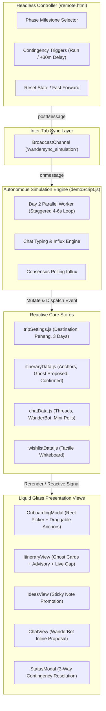
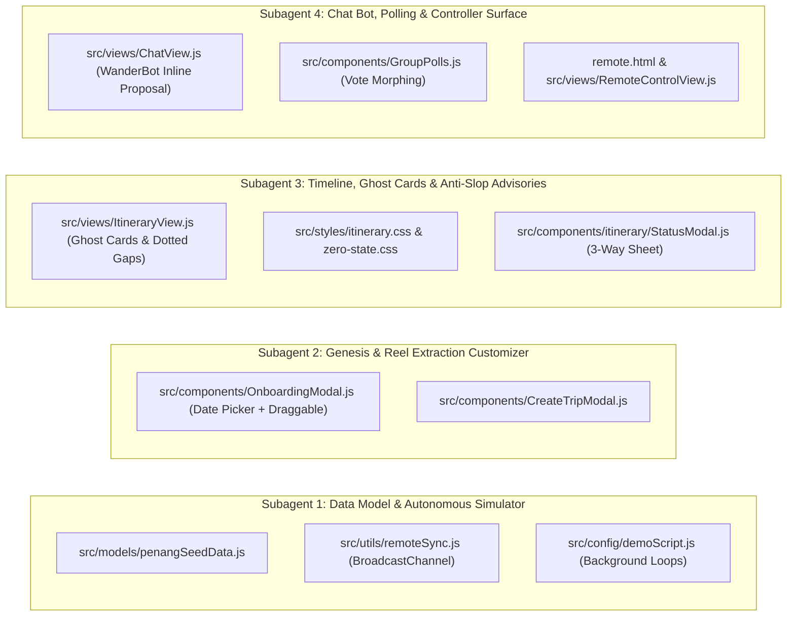

# WanderSync: Master Demo Implementation Plan (Penang Edition)

This document provides the engineering blueprint to transition [DEMO_FLOW.md](file:///root/.t3/worktrees/travel-planner/t3code-34ecd5ca/DEMO_FLOW.md) from specification into a presentation-ready, fully interactive application.

---

## 1. System Architecture & State Machine

---

## 2. Phase-by-Phase Button Interaction & Transition Matrix

### Act 1: Dynamic Genesis & Reel Extraction
- **Associated DEMO_FLOW.md Phase**: Section 3 - Act 1 (Genesis)
- **Starting State**: Clean zero-state timeline or fresh app load with Onboarding Modal open.
- **Button / Interaction Specifications**:
  1. **`#btn-select-reels` (Import from Social Reels)**:
     - *Action*: Transitions modal from step `'menu'` to step `'reels'`.
     - *UI Rendered*: Displays pre-filled input `https://www.instagram.com/reel/C8x9_penang_heritage` with sample demo reel card `@penangfoodie: 5 Hidden Heritage & Sunset Spots`.
  2. **Demo Reel Card Click (`.demo-reel-card`)**:
     - *Action*: Parses reel data and advances modal to `'customize'` step (new step replacing instant processing).
     - *UI Rendered*: 
       - **Date Customizer**: Start date input (`2026-10-12`), End date input (`2026-10-14`), and 3 quick duration pills: `[Weekend (3D)]` (Active), `[4 Days]`, `[5 Days]`.
       - **Draggable Anchors List**:
         - 📍 *Clan Jetties (Chew Jetty) Heritage Walk* (with drag handle `⋮⋮` and pill `[Day 1 ▾]`).
         - 📍 *Penang Hill Funicular & The Habitat Sunset Canopy Walk* (with drag handle `⋮⋮` and pill `[Day 1 ▾]`).
  3. **`#btn-build-itinerary` (Build Itinerary CTA)**:
     - *Action*: 
       - Saves trip settings: Destination = *"Penang, Malaysia"*, Total Days = `3`, Start = `2026-10-12`.
       - Empties existing mock data; sets Day 1 blocks to **strictly** the 2 extracted anchors (Chew Jetty at 09:30, Penang Hill at 16:30).
       - Injects active timeline gap indicator between them.
       - Dispatches global event `trip:created`.
       - Closes modal and opens `#itinerary` view.
     - *Leads to Act 2*: Fires background timer for Day 2 parallel generation.

---

### Act 2: Ambient Background Influx & Whiteboard Brainstorming
- **Associated DEMO_FLOW.md Phase**: Section 3 - Act 2 (Ambient Influx & Ideas)
- **Starting State**: Timeline displays Chew Jetty and Penang Hill with 4h gap between them.
- **Background Event (Automatic)**:
  - `T+4s`: Day 2 tab pill displays an unread activity badge `●`.
  - Background worker pushes *Entopia Butterfly Farm* and *Escape Adventure Park* into Day 2 data store without disrupting Day 1.
- **Button / Interaction Specifications**:
  1. **`#nav-tab-ideas` (Bottom Dock Ideas Tab)**:
     - *Action*: Navigates to Ideas & Whiteboard view (`#ideas`).
     - *UI Rendered*: Categorized sticky notes board.
  2. **`#btn-add-idea-modal` (+ Add Idea)**:
     - *Action*: Opens Add Idea sheet with title, category, and `[Propose to Group]` toggle.
  3. **`#btn-submit-idea`**:
     - *Action*: Adds a glowing yellow sticky note: *"Sunset Drinks at Bora Bora Batu Ferringhi"*.
  4. **`.btn-promote-to-day` (1-Tap Promote to Day 1)**:
     - *Action*: Dispatches item directly to Day 1 as an evening Proposed card; triggers toast: *"Promoted to Day 1 as Proposed slot"*.
     - *Leads to Act 3*: Presenter taps Bottom Dock Chat icon.

---

### Act 3: Conversational Intelligence & The Proposed Ghost Card
- **Associated DEMO_FLOW.md Phase**: Section 3 - Act 3 (Conversational AI)
- **Starting State**: Presenter clicks Bottom Dock `#nav-tab-chat`.
- **Button / Interaction Specifications**:
  1. **Opening Day 1 Discussion Thread**:
     - *Action*: Presenter selects *"Day 1: Chew Jetty & Penang Hill"* thread.
     - *Autonomous Sequence*:
       - `T+1.5s`: Tony's avatar slides in: *"Guys, what are we eating after Chew Jetty? Anyone craving Char Koay Teow or Chendul?"*
       - `T+3.5s`: Wei Gang replies: *"Lebuh Keng Kwee Famous Teochew Chendul is a must-try."*
       - `T+5.5s`: WanderBot inline card appears with light amber border:
         > **🤖 Meal Gap Detected (12:30 PM)**  
         > *Penang Road Famous Teochew Chendul & Asam Laksa* · 8 min Grab from Chew Jetty  
         > `<button id="btn-insert-proposal" class="btn btn--sm btn--primary">Insert as Proposed Slot</button>`
  2. **`#btn-insert-proposal`**:
     - *Action*: Injects block `d1-gap-meal` into Day 1 schedule with `status: 'proposed'`. Toast appears: *"Inserted into Day 1 as Proposed"*.
     - *Leads to Act 4*: Presenter clicks Bottom Dock Itinerary icon.

---

### Act 4: Consensus Polling & Anti-Slop Schedule Intelligence
- **Associated DEMO_FLOW.md Phase**: Section 3 - Act 4 (Consensus & Schedule Advisory)
- **Starting State**: Timeline displays Chew Jetty ➔ **Proposed Chendul Ghost Card** ➔ Penang Hill.
- **Button / Interaction Specifications**:
  1. **Ghost Card Interaction (`.timeline-card--proposed`)**:
     - *Visuals*: Dashed 1.5px amber border, translucent glass, `● PROPOSED DRAFT` badge.
     - *Buttons on Card Face*: `[✓ Confirm]` and `[🗳 Put to Vote]`.
  2. **`#btn-card-vote` (Put to Group Vote)**:
     - *Action*: Card morphs inline into an active voting card with progress bar `0/2 Votes`.
     - *Autonomous Timer*:
       - `T+1.0s`: Wei Gang votes (Bar fills 50%).
       - `T+2.2s`: Tony votes (Bar fills 100%, badge changes to "Consensus Reached!").
       - `T+3.0s`: Card smoothly animates from dashed amber into solid glass `timeline-card--confirmed` with green badge.
       - Transit buffers automatically slide in: *GrabCar (12 min)* from Chew Jetty, and *Transit (25 min)* to Penang Hill.
  3. **Anti-Slop AI Advisory Card (`.timeline-card__advisory`)**:
     - Rendered on Siam Road Char Koay Teow slot (19:00):
       > **Schedule Advisory**: *Siam Road Char Koay Teow is closed on Mondays. Consider swapping with Day 3.*  
       > `<button id="btn-shift-day3" class="btn btn--xs btn--outline">Shift to Day 3 · Wed</button>` `<button id="btn-dismiss-advisory" class="btn btn--xs btn--ghost">Keep Anyway</button>`
  4. **`#btn-shift-day3`**:
     - *Action*: Trigger iOS spring exit animation on card; removes from Day 1 and appends to Day 3. Day 1 timeline collapses cleanly without empty space.
  5. **`#day-pill-2` (Day 2 Tab Click)**:
     - *Action*: Switches to Day 2 view.
     - *Visual Reveal*: Reveals fully formed, confirmed schedule with Entopia Butterfly Farm and Escape Park that were populated in the background!
     - *Leads to Act 5*: Presenter clicks "Live HUD" in header.

---

### Act 5: Live HUD Execution & 3-Way Contingency
- **Associated DEMO_FLOW.md Phase**: Section 3 - Act 5 (Live HUD & Tropical Contingency)
- **Starting State**: Header button `#btn-open-live-hud` clicked.
- **Button / Interaction Specifications**:
  1. **Live HUD Mode Rendered**:
     - Header narrows, bottom navigation dock hides or collapses.
     - Shows **Current Spot**: *Clan Jetties (Chew Jetty)* with live countdown `Departure in 18m`.
     - Shows **Next Up**: *Penang Road Famous Teochew Chendul* with Grab route chip.
  2. **Simulating Disruption**:
     - *Trigger*: Presenter presses hotkey `Ctrl+Alt+R` (or clicks `[Simulate Monsoon Rain]` in `/remote.html`).
     - *Banner Alert*: Flashes minimal amber banner on Penang Hill spot: *"Weather Alert: Heavy Monsoon Downpour at Penang Hill Outdoor Station"*.
  3. **`#btn-resolve-contingency` (Review Contingency Options)**:
     - *Action*: Opens 3-way resolution bottom sheet:
       - **Button 1 (`#btn-opt-fallback`)**: *[🌧️ Switch to Indoor Fallback]* ➔ Replaces Penang Hill with *The Top Komtar Indoor Theme Park & Glass Rainbow Skywalk*.
       - **Button 2 (`#btn-opt-freetime`)**: *[☕ Hold Free-Time Pocket]* ➔ Converts slot into *ChinaHouse Cafe Relax Window*.
       - **Button 3 (`#btn-opt-reflow`)**: *[⏩ Chronological Reflow]* ➔ Deletes slot and shifts evening dinner forward by 90 minutes.
  4. **Clicking Option 1 (`#btn-opt-fallback`)**:
     - *Action*: Card title and details instantly swap to *The Top Komtar*; transit recalculates to George Town center. Live HUD status returns to optimal green.

---

## 3. Delegation Blueprint: Subagent Work Streams

To execute this modularly and avoid overlapping edits, the work is divided into 4 specialized subagent roles:

### Work Stream 1: Data Model & Autonomous Simulation Engine
* **Files Owned**:
  - `src/models/penangSeedData.js` *(New file: Authentic Penang venues & fallbacks)*
  - `src/models/itineraryData.js` *(Update initializers for sparse Day 1 & dynamic days)*
  - `src/utils/remoteSync.js` *(New file: BroadcastChannel listener & dispatcher)*
  - `src/config/demoScript.js` *(New file: Autonomous background timer for Day 2 & Day 3)*
* **Responsibilities**:
  1. Create `penangSeedData.js` with complete block structures for Chew Jetty, Penang Hill, Teochew Chendul, Siam Road CKT, The Top Komtar, ChinaHouse Cafe, Entopia Butterfly Farm, and Escape Adventure Park.
  2. Implement `remoteSync.js` enabling two-way messaging between the main app and `/remote.html`.
  3. Implement `demoScript.js` with autonomous timed queues (`startDay2Simulation()`, `triggerChatInflux()`, `simulatePollVotes()`).

### Work Stream 2: Genesis & Reel Extraction Customizer
* **Files Owned**:
  - `src/components/OnboardingModal.js`
  - `src/styles/components.css`
* **Responsibilities**:
  1. Add `'customize'` step to `OnboardingModal.js` after Reel URL selection.
  2. Render the customizer UI:
     - Start/End date inputs with quick pills (`Weekend (3D)`, `4 Days`, `5 Days`).
     - Draggable cards for extracted anchors (*Chew Jetty* & *Penang Hill*) with drag handles (`⋮⋮`) and day dropdown pills (`[Day 1 ▾]`).
  3. Wire "Build Itinerary" CTA to initialize the 3-Day trip and populate Day 1 with strictly the 2 anchors.

### Work Stream 3: Timeline, Ghost Cards & Anti-Slop Advisories
* **Files Owned**:
  - `src/views/ItineraryView.js`
  - `src/styles/itinerary.css`
  - `src/styles/zero-state.css`
  - `src/components/itinerary/StatusModal.js`
* **Responsibilities**:
  1. Render the **Dotted Timeline Gap Card** between Chew Jetty and Penang Hill with 1-tap AI recommendation prompt.
  2. Implement the **Frosted Glass Dashed Ghost Card** (`.timeline-card--proposed`) with `[✓ Confirm]` and `[🗳 Put to Vote]` buttons.
  3. Implement the **Apple iOS 26 Schedule Advisory Card** on Siam Road CKT with 1-tap `[Shift to Day 3]` spring animation.
  4. Implement the **3-Way Contingency Resolution Sheet** in `StatusModal.js` (`Switch to Fallback` / `Free Time` / `Reflow`).

### Work Stream 4: Chat Intelligence, Polling & Remote Controller
* **Files Owned**:
  - `src/views/ChatView.js`
  - `src/components/GroupPolls.js`
  - `remote.html` *(New standalone presenter control surface)*
* **Responsibilities**:
  1. Render WanderBot's inline proposal card in the Day 1 Chat thread with the `[+ Insert as Proposed Slot]` button.
  2. Implement the instant 2-step vote animation that morphs the card into a solid green Confirmed card with GrabCar buffer recalculation.
  3. Build `remote.html`: a clean, mobile-responsive presenter dashboard with phase triggers (`[Act 1: Genesis]`, `[Act 2: Chat Influx]`, `[Act 3: Rain Disruption]`, `[Fast-Forward / Reset]`).

---

## 4. Verification & Testing Matrix

| Test ID | Target Phase | Action | Expected Visual Outcome |
| :--- | :--- | :--- | :--- |
| **TEST-01** | Act 1 | Click demo reel card in modal | Opens Customize screen with Oct 12–14 (3 Days) pre-selected and 2 draggable Penang spots. |
| **TEST-02** | Act 1 | Reorder spots & click Build Itinerary | Day 1 opens with strictly Chew Jetty (09:30) and Penang Hill (16:30); dotted gap card renders between them. |
| **TEST-03** | Act 2 | Wait 6s after genesis | Amber dot `●` appears on Day 2 tab; switching to Day 2 reveals Entopia and Escape populating in real time. |
| **TEST-04** | Act 3 | Open Day 1 Chat thread | Tony and Wei Gang chat messages appear with 2s delay; WanderBot proposal card renders. |
| **TEST-05** | Act 4 | Click "Insert as Proposed Slot" | Navigating to Itinerary shows dashed amber ghost card for Teochew Chendul in the gap slot. |
| **TEST-06** | Act 4 | Click "Put to Group Vote" | Progress bar fills to 100% over 2.5s; card morphs into solid Confirmed card with GrabCar buffer. |
| **TEST-07** | Act 4 | Click "Shift to Day 3" on advisory | Siam Road CKT card lifts out of Day 1 and docks into Day 3; timeline gaps close smoothly. |
| **TEST-08** | Act 5 | Trigger rain disruption via `/remote` | Live HUD displays contingency sheet; tapping "Switch to Fallback" swaps Penang Hill for The Top Komtar. |
