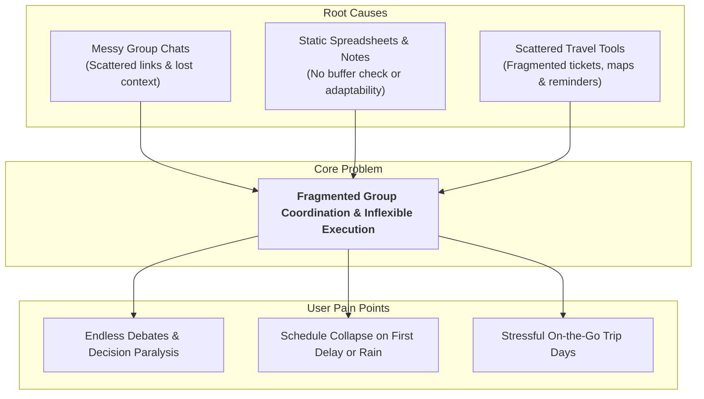
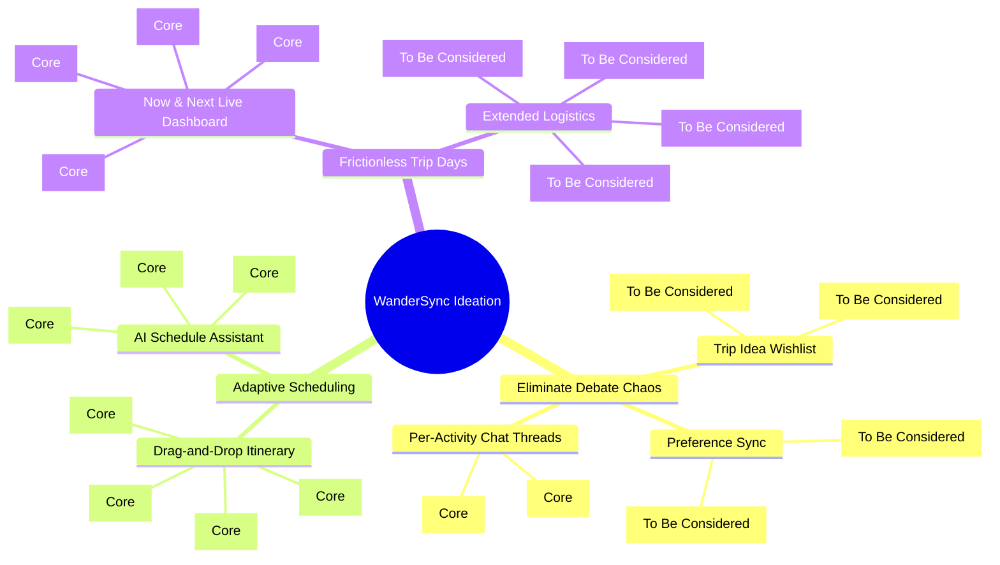
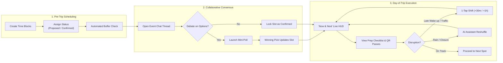

# Product Requirements Document (PRD)
## Project: WanderSync (Travel Planner)
**Status:** Active | **Contributors:** Clarence, Tony, wg | **Platform:** Mobile-First Web App (375px – 430px)

---

## 1. Executive Summary & Problem Statement

**WanderSync** is a mobile-first collaborative travel app designed to streamline group trips from pre-trip planning to day-of-trip execution.

### The Problem
1. **Communication Chaos**: Group travel discussions are scattered across messy chat apps; decisions, links, and timing agreements get buried.
2. **Fragile Schedules**: Fixed spreadsheets cannot withstand real-world travel delays, weather disruptions, or unrealistic transit buffers.
3. **Execution Stress**: On travel days, switching between maps, ticket screenshots, and packing lists causes confusion and missed reservations.

---

## 2. Product Scope Strategy

To deliver a validated, high-quality MVP fast, the project focuses exclusively on **Four Core Features**. Secondary and exploratory ideas from the discovery backlog (Tab 2) are deferred to **Section 5: To Be Considered**.

| Scope Category | Features Included |
| :--- | :--- |
| **In-Scope (4 Core Features)** | 1. Interactive Drag-and-Drop Itinerary 2. Per-Activity Chat Threads & Mini-Polls 3. AI Schedule Assistant 4. "Now & Next" Live Dashboard |
| **Deferred (To Be Considered)** | • Group Attraction Swiping • Solo Vibe Selector • Trip Idea Wishlist & Interactive Board • Shared Bill Splitter • Group Dietary & Allergy Filter • Carpool & Transit Logistics • Split-Group Branching Schedules |

---

## 3. Visual Diagrams & Mindmaps (Ideation & Flow)

### 3.1 Problem Tree (Root Causes to Symptoms)

### 3.2 Ideation Mindmap (Solution Mapping & Scope Breakdown)

### 3.3 End-to-End User Flow

---

## 4. Current Core Features (In-Scope)

### 4.1 Feature 1: Interactive Drag-and-Drop Itinerary
*Owner: Clarence | Priority: Must Have*
- **Visual Time Blocks**: Categorized into `Activity`, `Meal`, `Transit`, and `Rest`. Drag to reorder with automatic time recalculation.
- **Slot Status Lifecycle**:
  - 🟡 **Proposed**: Awaiting group consensus.
  - 🟢 **Confirmed**: Locked in with reservation/ticket.
  - 🟠 **Weather Permitting**: Contingent outdoor plan linked to an indoor fallback.
- **Transit Buffer Warnings**: Visual warnings if transit time between consecutive stops is inadequate (e.g. 10 mins allocated for a 30-min train).
- **Requirement Tags**: Inline alerts for dress codes (e.g., *"No sandals for temple"*), passport needs, or advance ticket bookings.

### 4.2 Feature 2: Per-Activity Chat Threads & Mini-Polls
*Owner: Tony & wg | Priority: Core*
- **Contextual Threading**: Dedicated discussion space attached to each specific timeline card, keeping meal/timing debates out of general chat.
- **Native Mini-Polls**: 1-click in-thread voting (e.g., *"7 AM Sunrise vs 10 AM Brunch"*). A winning vote automatically updates the itinerary slot.

### 4.3 Feature 3: AI Schedule Assistant
*Owner: Tony | Priority: Core*
- **AI Copilot & Hashtag Commands**: Shorthand prompt actions such as `#poll`, `#optimize-buffers`, and `#dietary-check`.
- **Pace Optimizer**: Preset intensity tuning (*Chill & Relaxed*, *Balanced*, *Turbo Explorer*).
- **Disruption Reshuffle**: Suggests schedule reorganizations during delays or bad weather, presented as a 1-tap accept proposal card.

### 4.4 Feature 4: "Now & Next" Live Dashboard
*Owner: wg | Priority: Core*
- **"NOW" Active Spot HUD**: Displays current venue, countdown timer, map directions link, and entry ticket QR codes.
- **"NEXT" Card**: Shows upcoming activity, transit line, and departure countdown.
- **1-Tap Schedule Shift**: Instantly shifts remaining flexible events forward by `+30 Mins` or `+1 Hour` when running late, preserving hard booking times.
- **Daily Prep Checklist**: Quick pre-departure essentials (power bank, physical pass, cash-only warning).

---

## 5. To Be Considered (Future Backlog)

Features from the Tab 2 backlog deferred for subsequent development phases:

| Feature | Tab 2 Owner & Priority | Description & Consideration |
| :--- | :--- | :--- |
| **Group Attraction Swiping** | Clarence (Must Have) | Tinder-style swipe deck for group members to vote right/left on spots; app tallies consensus. *Needs swipe UI library and recommendation API.* |
| **Solo Vibe Selector** | (Must Have) | 1-click tailored itinerary generation based on traveler styles (*Budget Backpacker*, *Chill Cafe*). *Can integrate into AI Assistant prompts.* |
| **Trip Idea Wishlist & Board** | Tony (Should Have) | Shared unassigned link/photo bucket with constraint tags (*Must Go*, *Too Expensive*) and sticky notes canvas. |
| **Shared Bill Splitter** | Clarence (Should Have) | In-event expense logger and real-time settlement ledger calculating who owes whom. *Needs multi-currency & debt simplification.* |
| **Group Dietary Filter** | (Should Have) | Cross-references group allergies/dietary constraints against candidate restaurant menus before adding to schedule. |
| **Carpool & Transit Planner** | wg (Must Have) | Carpool seat assignments, pickup locations, transit route tracking, and walking distances. |
| **Split-Group Schedules** | (Extended Idea) | Branching parallel timeline blocks, isolated sub-chats, and dedicated budgets for subgroup daytime activities. |
