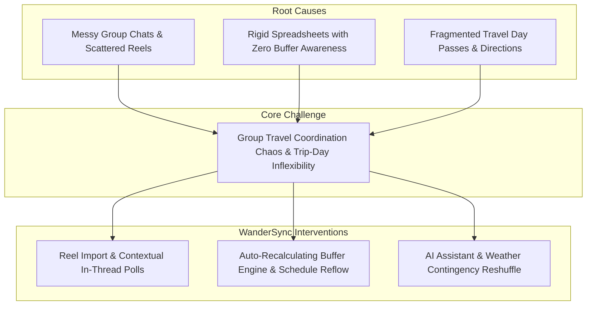
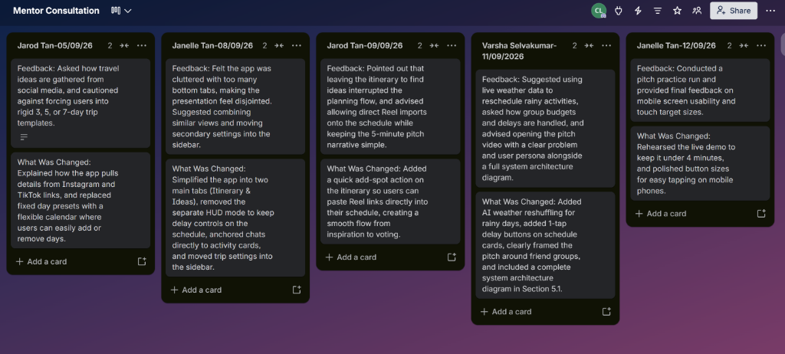
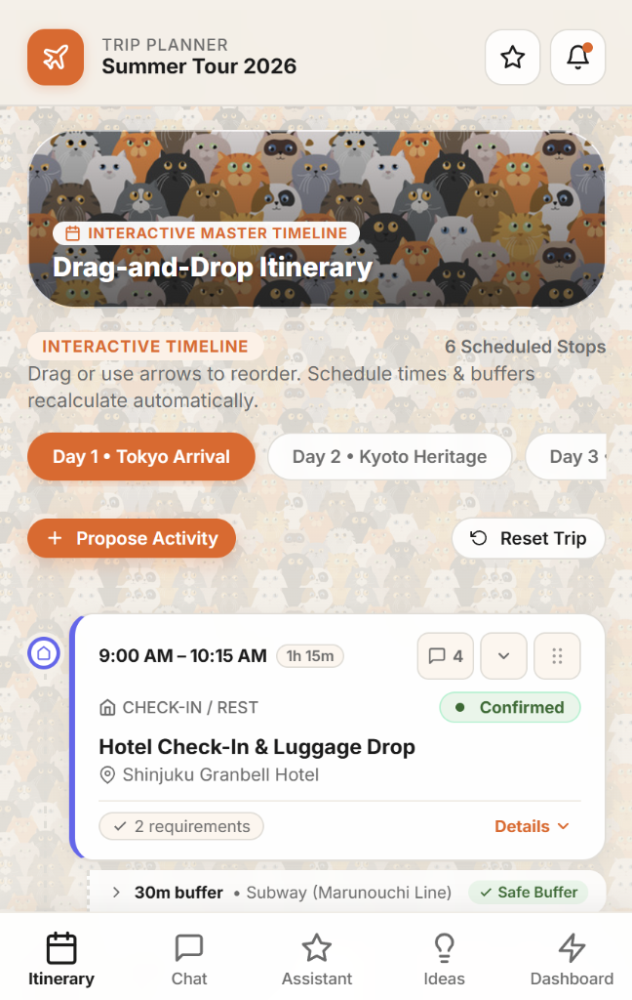
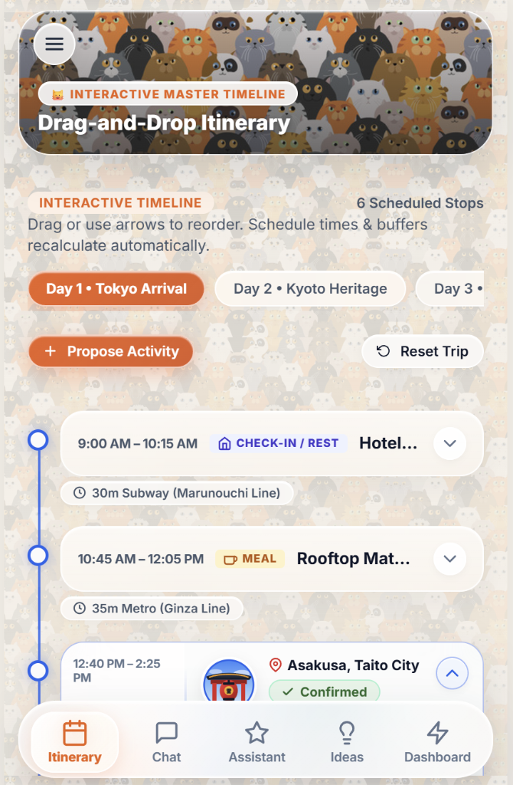
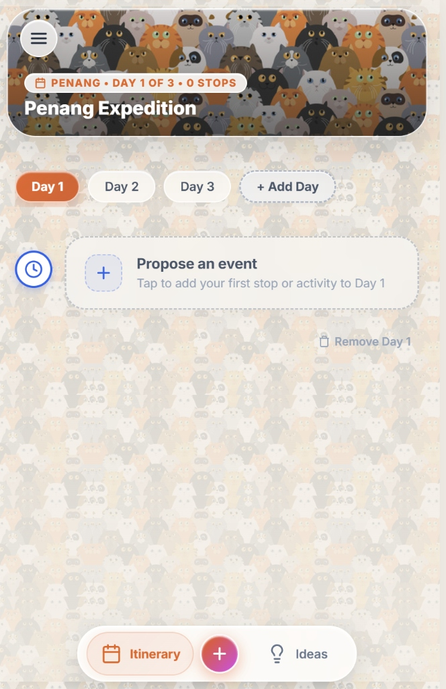
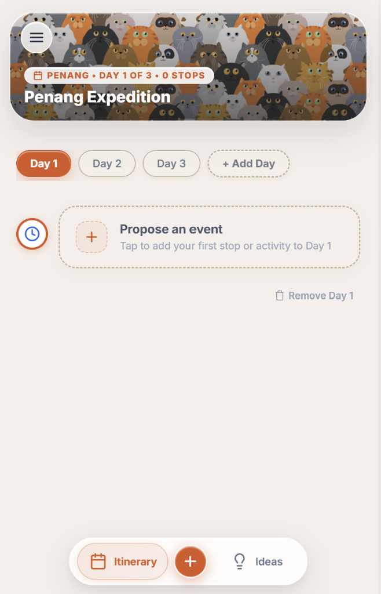
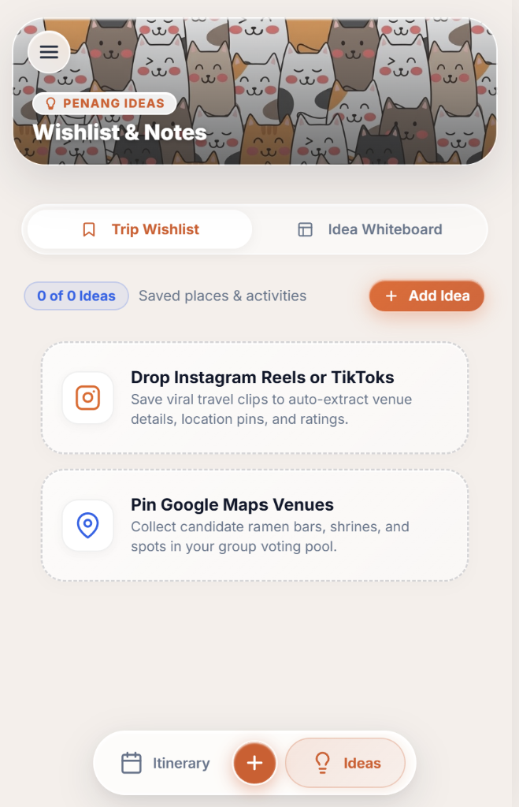
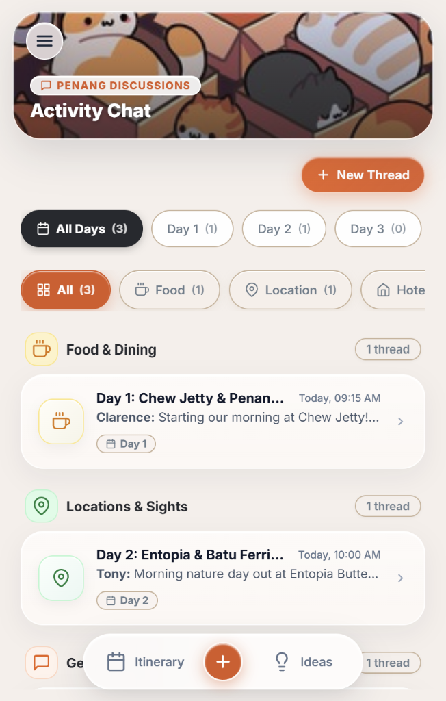
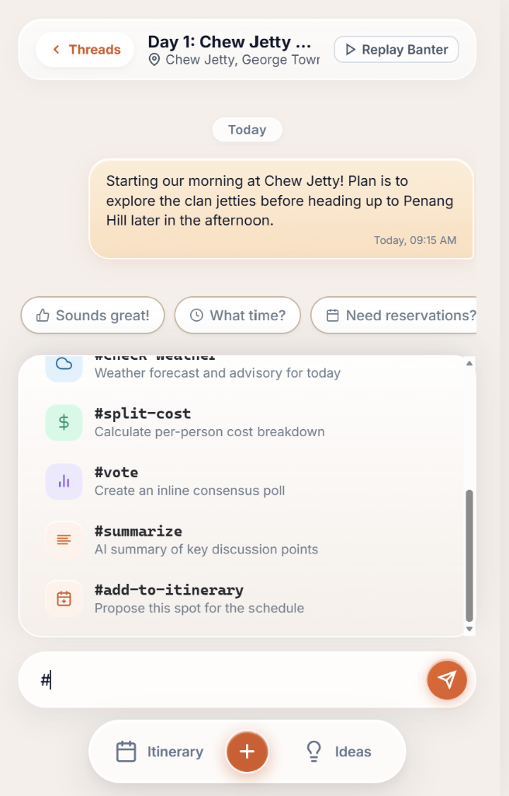

# WanderSync by WanderSync Team

**Team:** Clearence, Tony, Wei Gang  
**Problem Statement:** Travel Planner  
**Video Presentation:** [Unlisted Youtube Link]  
**Presentation Slides:** [Public Link]  

---

## 1. Project Overview

### The Problem
Planning a group trip with friends is usually messy and frustrating. Recommendations and links get buried across WhatsApp chats, Instagram DMs, and separate notes apps. When the group finally puts a plan into a spreadsheet, it easily falls apart—often because nobody accounted for actual walking or train times between stops. And if bad weather hits or a spot is closed, manually updating every single time slot on your phone while walking around ruins the mood.

### Our Solution
WanderSync is a mobile travel planner that makes group trips effortless. Friends can save places directly from Instagram Reels and TikTok into a shared wishlist, vote on activities right inside the schedule, and drag and drop stops to build the perfect day. The app automatically warns you if there isn't enough travel time between spots, and our AI assistant quickly suggests backup plans if plans change or it rains—keeping everyone relaxed and on track.

**Core Feature Set:**
- **Smart Drag-and-Drop Schedule & Transit Buffer Warnings**
- **Instagram Reels & TikTok Video Import**
- **In-Schedule Group Chat & Mini-Polls**
- **Smart Cancellation & Auto-Rescheduling**
- **AI Schedule Optimizer**

---

## 2. Ideation & Process

### 2.1 Ideas We Considered

| Idea | Why it was dropped / kept |
| :--- | :--- |
| **Interactive Drag-and-Drop Timeline with Buffer Warnings (Chosen)** | **Kept:** Solves the core failure of static spreadsheets by automatically checking whether walking or subway time between consecutive stops is physically realistic. |
| **Social Reels / TikTok Import & Wishlist (Chosen)** | **Kept:** Captures where travelers actually get their inspiration today, removing the tedious chore of manual data entry. |
| **Contextual Activity Discussion & Mini-Polls (Chosen)** | **Kept:** Eliminates endless WhatsApp debates by tying discussions directly to specific schedule slots and resolving ties via 1-tap voting. |
| **Dedicated "Live Day HUD" Execution Mode** | **Dropped (Deferred):** Introducing a separate execution screen fragmented the user experience; 1-tap delay shifts (+30m/+1h) and transit cues were integrated directly into the core itinerary timeline instead. |
| **Tinder-Style Group Attraction Swiping** | **Dropped (Deferred):** Fun concept, but created decision fatigue for groups with diverging tastes and added unnecessary UI complexity to the MVP. |
| **Shared Multi-Currency Bill Splitter** | **Dropped (Deferred):** Excellent utility, but specialized expense tools (Splitwise) already dominate; focusing on schedule coordination delivered higher novel value. |
| **Split-Group Branching Schedules** | **Dropped (Deferred):** Over-complicated the timeline UI for casual weekend group getaways. Kept schedule unified with flexible free-time slots. |

### 2.2 Ideation Boards

*Figure 2.1: Problem tree illustrating root causes and WanderSync core architectural interventions.*

### 2.3 Mentor Consultation

**Design Evolution:**

| 1st Generation | | 2nd Generation | | 3rd Generation | | 4th Generation (Current) |
| :---: | :---: | :---: | :---: | :---: | :---: | :---: |
|  | ➔ |  | ➔ |  | ➔ |  |
| **Initial 5-Tab Layout** Top app bar & busy full wallpaper | | **Integrated Header** Merged top bar & timeline slots | | **Streamlined Navigation** 2 bottom tabs, central (+) & dynamic days | | **Liquid Glass Polish** Clean high-contrast canvas & refined cards |

---

## 3. Design & Prototype

**UI Prototype:** [Public Link]

*(Check that it opens in an incognito window.)*

| **Screen 1** Dynamic Itinerary & Buffer Guard | **Screen 2** Social Reel Spotlight & Wishlist | **Screen 3** Contextual Discussion & Mini-Poll | **Screen 4** AI Schedule Copilot & Disruption Reflow |
| :---: | :---: | :---: | :---: |
|  |  |  |  |
| *Chronological timeline with transit cushions and status indicators.* | *Extracted video content with visual source attribution.* | *Inline consensus voting resolving conflicting preferences.* | *Intelligent schedule reshuffling and prompt shortcuts for weather contingencies.* |

---

## 4. What Makes It Different

| Feature | WanderSync Twist | Existing Tools (TripIt / Wanderlog) |
| :--- | :--- | :--- |
| **Travel Time Warnings** | Warns you immediately if there isn't enough walking or train time between spots, helping you avoid rushed dashes and missed reservations. | Schedules ignore realistic travel cushions, making it easy to run late or miss bookings. |
| **Import from Instagram & TikTok** | Pulls place names, addresses, and photos directly from shared Reels and TikTok links into your group's idea list. | Forces you to manually copy and paste names, links, and addresses from social apps one by one. |
| **Vote Directly on Plans** | Friends vote right on activity cards, and the winning spot automatically slots straight into the day's timeline. | Group decisions get lost in long chat threads, requiring someone to manually copy the final choice into the plan. |
| **1-Tap Delay & Schedule Shifts** | Running late? Tap `+30m` to smoothly push back later plans, or remove a stop and let the schedule adjust automatically. | If one activity is delayed, you have to manually edit the start and end times for every single remaining stop. |

---

## 5. Technical Architecture & Feasibility

> [!NOTE]
> **Prototype Validation vs. Production Build Phase:**  
> The current repository implementation serves as our rapid client-side prototype (Vanilla JS / Vite / LocalStorage simulation) engineered for immediate 60fps tactile validation, offline resilience, and interactive pitch delivery. The architecture outlined below details the production-ready, scalable stack that our team will implement during the formal **Building Phase**.

---

### 5.1 Production Tech Stack

| Layer | Technology | Why We Chose It | Constraints & How We Mitigate Them |
| :--- | :--- | :--- | :--- |
| **Frontend** | **Next.js 15 (App Router, React 19, TypeScript)** with Tailwind CSS & Apple Liquid Glass tokens | • Makes pages load quickly on mobile phones. • Automatically shrinks and sharpens photos saved from Instagram and TikTok. • Creates simple shareable links for group members. | **Constraint:** Moving schedule cards quickly could feel slow or laggy. **Mitigation:** The screen updates immediately when dragging a card, then saves the changes to the database quietly in the background. |
| **Backend & APIs** | **Next.js Route Handlers & Server Actions** + **Supabase Edge Functions** (Deno) | • Keeps website and server code in one place for faster development. • Prevents connection errors between screens and server logic. • Runs quick background jobs without slowing down the user. | **Constraint:** Complex AI planning tasks might take too long and time out. **Mitigation:** Stream AI answers word-by-word so travelers see suggestions instantly instead of waiting. |
| **Database** | **PostgreSQL** (Managed via **Supabase Cloud**) | • Keeps trip details organized cleanly (days, stops, and group votes stay linked). • Stores extra details from social media Reels with ease. • Ensures private trip plans can only be seen by invited friends. | **Constraint:** Having many friends open the app at once could overload database connections. **Mitigation:** Uses Supabase's connection manager to share connections safely without crashing. |
| **Real-Time Sync** | **Supabase Realtime** (Postgres CDC & Broadcast Channels) | • Updates everyone's screen instantly—when one person moves a stop or votes in a poll, everyone sees it right away without refreshing the page. | **Constraint:** Weak travel Wi-Fi or mobile data could drop or repeat updates. **Mitigation:** Changes show on screen immediately and use timestamps to ignore accidental duplicate messages. |
| **AI Engine (LLM)** | **Google Gemini** (**Gemini 2.0 Flash** via `@google/genai` SDK & Vercel AI SDK) | • Responds in under a second for fast schedule changes. • Can read photos and video screenshots from travel Reels. • Easily handles long multi-day trips and lots of group chat messages at once. • Reliably outputs clean, structured schedule updates. | **Constraint:** Daily AI request limits or slow internet connections while on the road. **Mitigation:** Saves answers for popular tourist spots to reuse them, and falls back to simple built-in rules if the AI is slow to reply. |
| **APIs & Services** | • **Social Reel Extraction:** RapidAPI / Apify Instagram & TikTok Scraper • **Transit & Routing:** Google Places & Routes API (OSRM fallback) • **Weather Intelligence:** OpenWeatherMap API / Weather MCP Server • **Auth & Storage:** Supabase Auth (Google & Apple OAuth) + Supabase S3 Storage | • Saves users from having to type in places, addresses, and photos by hand. • Gives realistic walking and train travel times between stops. • Checks the weather forecast to warn of rain and recommend indoor alternatives. • Lets friends sign in easily with Google or Apple, and safely stores ticket QR codes. | **Constraint:** Third-party APIs charge per search and have daily usage limits. **Mitigation:** Saves travel times between popular landmarks in our database, keeps Reel info for 48 hours to avoid repeated calls, and shrinks ticket image sizes. |
| **Hosting & Infra** | **Vercel Edge Network** (Frontend & Server Actions) + **Supabase Cloud** (Tokyo/Singapore Region) | • Loads fast anywhere in the world. • Places database servers close to popular travel destinations in Asia for quick response times. • Needs zero manual server maintenance. | **Constraint:** Free hosting plans have monthly bandwidth limits. **Mitigation:** Saves ready-made page previews so the server does not have to rebuild the page every time someone views an itinerary. |

---

### 5.2 System Architecture Diagram

'

*Figure 5.1: WanderSync Architecture Diagram*

---

### 5.3 Build Plan & Scope

To make sure we build a high-quality, reliable app on time, we are focusing strictly on what matters most to travelers: **finding inspiration, planning together without arguments, and stress-free schedule adjustments during the trip**.

#### What We Are Building (In-Scope)

> **🏁 Week 1 Milestone – Core Itinerary** | **🏁 Week 2 Milestone – AI and Chat**

1. **Clarence – Itinerary & Interaction**
   - Build an interactive visual timeline that displays all daily activities in chronological order.
   - Implement drag reorder & recalculation so that moving a stop automatically updates all subsequent travel buffers.
   - Add activity status & lifecycle indicators (planned, in-progress, done) to each timeline card.
   - Create timeline-to-thread deep linking so tapping an activity jumps directly to its discussion thread.

2. **Tony – AI Assistant and Chat**
   - Design and implement the onboarding UI, covering sign-in, trip creation, and friend invites.
   - Integrate the Gemini AI copilot for smart schedule suggestions and pacing adjustments (*Relaxed*, *Balanced*, *Fast-Paced*).
   - Build 1-tap disruption reshuffling so a single tap cascades a delay or cancellation across all affected stops.
   - Deliver Live HUD and final polish for the trip-day execution view with real-time countdowns.

3. **Weigang – Live HUD & AI Hashtag**
   - Build per-activity threads and polls so friends can discuss and vote directly on individual schedule cards.
   - Implement AI hashtag command shortcuts (e.g. `#rain`, `#hungry`) that trigger instant contextual suggestions.
   - Add departure and transit countdowns that surface the next required travel action at the right moment.

#### What We Are Leaving Out for Now (Out-of-Scope)

To keep the app simple, fast, and delivered on schedule, we are holding off on features that add clutter or already have great standalone tools:
- **Separate "Live Day" Mode**: We keep delay buttons and schedules in one unified view so users don't have to jump between different screens while traveling.
- **In-App Bill Splitting**: Popular apps like Splitwise already do this well. We focus our energy on smooth schedule planning.
- **Split-Group Branching Paths**: Having different sub-schedules for different people creates confusion. Simple free-time blocks give friends flexibility without cluttering the plan.
- **Native App Store Downloads**: The app works smoothly in mobile web browsers without requiring users to download large files from an app store.
