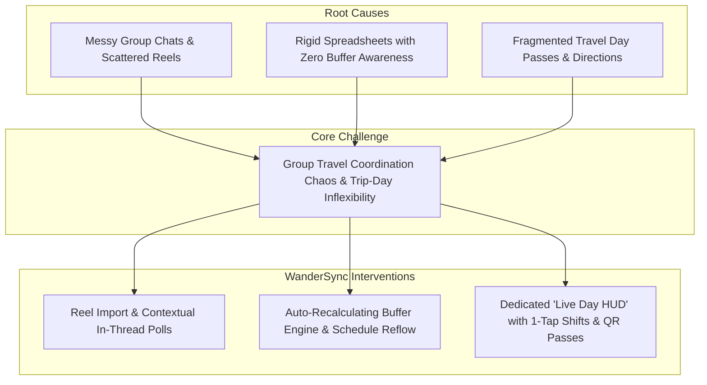

# WanderSync by WanderSync Team

**Team:** Clearence, Tony, Wei Gang  
**Problem Statement:** Travel Planner  
**Video Presentation:** [Unlisted Youtube Link]  
**Presentation Slides:** [Public Link]  

---

## 1. Project Overview

### The Problem
Coordinating group travel is plagued by communication chaos, fragile static schedules, and high execution stress on travel days. Group discussions and recommendations are fragmented across WhatsApp, Instagram DMs, and notes apps, causing links and agreements to get lost. When plans are finalized in static spreadsheets or rigid apps like TripIt and Wanderlog, they crumble upon the first delayed train or rainy afternoon because they lack real-time transit buffer intelligence. Existing tools either focus purely on flight confirmations (TripIt) without social consensus tools, or offer complex desktop-first spreadsheets (Wanderlog) that overwhelm travelers on mobile during active trip days.

### Our Solution
WanderSync is a mobile-first collaborative travel companion that unites real-time social idea capture, intelligent drag-and-drop scheduling, and high-focus day-of-trip execution. Travelers can import recommendations directly from Instagram Reels, vote on candidates via contextual per-activity mini-polls, and watch their itinerary automatically recalculate transit buffers. When delays happen or weather shifts, 1-tap schedule shifts and contingency reshuffling keep the group on track without friction.

**Core Feature Set:**
- **Dynamic Drag-and-Drop Itinerary:** Interactive time blocks with real-time transit buffer warnings and flexible day management (arbitrary trip dates with add/remove day controls).
- **Social Reel & Wishlist Influx:** Instant extraction of social media travel reels into a group discovery pool with spotlight badges and creator previews.
- **Contextual Activity Threads & Mini-Polls:** Anchored micro-discussions on specific venues with embedded voting that automatically commits winning options to the schedule.
- **Event Cancellation & Schedule Reflow:** Smart handling of cancellations allowing groups to either preserve a free-time pocket or reflow subsequent events forward.
- **Live Day HUD Mode:** A streamlined, zero-distraction day-of-trip dashboard displaying the current spot countdown, transit directions, entry QR passes, and 1-tap delay shifts (+30m / +1h).
- **Personalized Appearance & AI Copilot:** Customizable cover aesthetics and pace-tuning assistant for weather contingencies.

---

## 2. Ideation & Process

### 2.1 Ideas We Considered

| Idea | Why it was dropped / kept |
| :--- | :--- |
| **Interactive Drag-and-Drop Timeline with Buffer Warnings (Chosen)** | **Kept:** Solves the core failure of static spreadsheets by automatically checking whether walking or subway time between consecutive stops is physically realistic. |
| **Social Reels / TikTok Import & Wishlist (Chosen)** | **Kept:** Captures where travelers actually get their inspiration today, removing the tedious chore of manual data entry. |
| **Contextual Activity Discussion & Mini-Polls (Chosen)** | **Kept:** Eliminates endless WhatsApp debates by tying discussions directly to specific schedule slots and resolving ties via 1-tap voting. |
| **Dedicated "Live Day HUD" Execution Mode (Chosen)** | **Kept:** High cognitive overload on trip days requires a stripped-down interface showing only "Now & Next" with quick pass access. |
| **Tinder-Style Group Attraction Swiping** | **Dropped (Deferred):** Fun concept, but created decision fatigue for groups with diverging tastes and added unnecessary UI complexity to the MVP. |
| **Shared Multi-Currency Bill Splitter** | **Dropped (Deferred):** Excellent utility, but specialized expense tools (Splitwise) already dominate; focusing on schedule coordination delivered higher novel value. |
| **Split-Group Branching Schedules** | **Dropped (Deferred):** Over-complicated the timeline UI for casual weekend group getaways. Kept schedule unified with flexible free-time slots. |

### 2.2 Ideation Boards

*Ideation diagrams, problem trees, and user flow architectures will be placed here by the team.*

*Figure 2.1: Problem tree illustrating root causes and WanderSync core architectural interventions.*

*(Additional mindmaps, affinity diagrams, and scribble boards to be embedded during the submission phase)*

### 2.3 Mentor Consultation

| Date | Mentor | Feedback Received | What Was Changed |
| :--- | :--- | :--- | :--- |
| **05/09/2026** | Mentor Review 1 | Inquired about how we source travel data, handle unstructured inputs, and whether users would be forced into static templates. | Clarified the Reels/TikTok auto-extraction pipeline, and transitioned from hardcoded 3/5/7-day presets to flexible arbitrary calendar ranges with dynamic add/remove day controls. |
| **08/09/2026** | Mentor Review 2 | Main feedback was that the interface felt messy, with too many disparate tabs causing a fragmented demo flow. Advised combining similar views and hiding secondary items into the sidebar. | Consolidated navigation into a unified flow: merged Itinerary with Day HUD mode, anchored chat directly to itinerary cards & ideas, relocated AI preferences & cover customization to the sidebar, and built a dedicated progressive demo simulation. |

---

## 3. Design & Prototype

**UI Prototype:** [Public Link]

*(Check that it opens in an incognito window. Key screen mockups and interactive screenshots with captions will be added here by the team)*

- **Screen 1: Dynamic Itinerary & Buffer Guard** — *Caption: Chronological timeline with transit cushions and status indicators.*
- **Screen 2: Social Reel Spotlight & Wishlist** — *Caption: Extracted video content with visual source attribution.*
- **Screen 3: Contextual Discussion & Mini-Poll** — *Caption: Inline consensus voting resolving conflicting preferences.*
- **Screen 4: Live Day HUD Mode** — *Caption: Focused execution screen with 1-tap QR passes and schedule delay shifts.*

---

## 4. What Makes It Different

| Feature | WanderSync Twist | Existing Tools (TripIt / Wanderlog) |
| :--- | :--- | :--- |
| **Transit Buffer Engine** | Automatically detects when subway/walking cushion is inadequate and displays warning alerts in real time. | Static itineraries ignore real-world transit cushions, causing missed reservations. |
| **Social Media Native Influx** | Extracts hero venues directly from shared Instagram Reels and TikToks into a group proposal pool. | Requires manual copy-pasting of addresses and notes from social apps. |
| **Contextual Activity Polling** | Voting is tied directly to candidate cards; winning option instantly slots into the day's timeline. | Decisions happen in chat apps, requiring someone to manually transcribe the result to the plan. |
| **Contingency & Reflow Intelligence** | 1-tap `+30m` delay shifts and flexible cancellation (keep free-time pocket vs chronologically reflow). | Delaying one item requires manually updating every subsequent item's start/end time. |
| **Dedicated "Live Day HUD"** | Strips away planning clutter on travel day to display only the active venue, countdown, and pass. | Overwhelms travelers on mobile with dense spreadsheet grids while walking. |

---

## 5. Technical Architecture & Feasibility

### Tech Stack
- **Frontend:** Vanilla JavaScript (Modern ES Modules) — *Chosen for zero-overhead bundle size, near-instant 60fps mobile drag-and-drop interactions, and complete framework independence.*
- **Styling & Design System:** Custom CSS3 with Apple iOS Liquid Glass design tokens — *Delivers a high-polish native app feel, fluid backdrop blurs, and responsive touch ergonomics.*
- **Build & Bundler:** Vite — *Provides lightning-fast hot module replacement (HMR) and optimized static asset packaging.*
- **Data Architecture:** LocalStorage persistence with an extensible JSON event simulation engine — *Allows offline functionality and seamless client-side live demo state playback.*
- **Hosting:** Netlify / Vercel static deployment — *Instant global edge distribution with zero server cold starts.*

### Build Plan & Scope
During the build phase, our scope focuses squarely on the high-value collaborative loop:
1. **Scope 1 (Core):** Smooth drag-and-drop timeline with automated transit buffer engine and dynamic day management.
2. **Scope 2 (Collaboration):** Reel extraction into wishlist, contextual card discussion drawers, and in-line voting resolution.
3. **Scope 3 (Execution):** Dedicated "Live Day HUD" mode with 1-tap shift controls and status cancellation (reflow vs pocket).
4. **Scope 4 (Demo Reliability):** Progressive simulation engine enabling smooth, realistic presentation from zero-state to populated plan.
