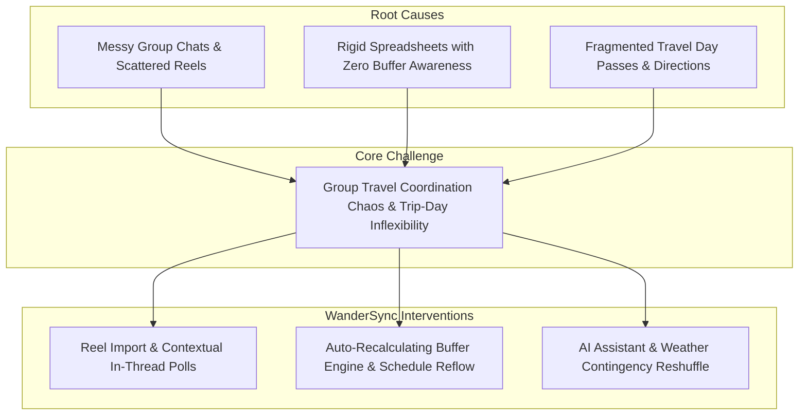

# WanderSync by WanderSync Team

**Team:** Clearence, Tony, Wei Gang  
**Problem Statement:** Travel Planner  
**Video Presentation:** [Unlisted Youtube Link]  
**Presentation Slides:** [Public Link]  

---

## 1. Project Overview

### The Problem
Planning a group trip with friends is usually messy and frustrating. Recommendations and links get buried across WhatsApp chats, Instagram DMs, and separate notes apps. When the group finally puts a plan into a spreadsheet, it easily falls apart—often because nobody accounted for actual walking or train times between stops. And if bad weather hits or a spot is closed, manually updating every single time slot on your phone while walking around ruins the mood.

### Our Solution
WanderSync is a mobile travel planner that makes group trips effortless. Friends can save places directly from Instagram Reels and TikTok into a shared wishlist, vote on activities right inside the schedule, and drag and drop stops to build the perfect day. The app automatically warns you if there isn't enough travel time between spots, and our AI assistant quickly suggests backup plans if plans change or it rains—keeping everyone relaxed and on track.

**Core Feature Set:**
- **Smart Drag-and-Drop Schedule & Transit Buffer Warnings**
- **Instagram Reels & TikTok Video Import**
- **In-Schedule Group Chat & Mini-Polls**
- **Smart Cancellation & Auto-Rescheduling**
- **AI Schedule Optimizer**

---

## 2. Ideation & Process

### 2.1 Ideas We Considered

| Idea | Why it was dropped / kept |
| :--- | :--- |
| **Interactive Drag-and-Drop Timeline with Buffer Warnings (Chosen)** | **Kept:** Solves the core failure of static spreadsheets by automatically checking whether walking or subway time between consecutive stops is physically realistic. |
| **Social Reels / TikTok Import & Wishlist (Chosen)** | **Kept:** Captures where travelers actually get their inspiration today, removing the tedious chore of manual data entry. |
| **Contextual Activity Discussion & Mini-Polls (Chosen)** | **Kept:** Eliminates endless WhatsApp debates by tying discussions directly to specific schedule slots and resolving ties via 1-tap voting. |
| **Dedicated "Live Day HUD" Execution Mode** | **Dropped (Deferred):** Introducing a separate execution screen fragmented the user experience; 1-tap delay shifts (+30m/+1h) and transit cues were integrated directly into the core itinerary timeline instead. |
| **Tinder-Style Group Attraction Swiping** | **Dropped (Deferred):** Fun concept, but created decision fatigue for groups with diverging tastes and added unnecessary UI complexity to the MVP. |
| **Shared Multi-Currency Bill Splitter** | **Dropped (Deferred):** Excellent utility, but specialized expense tools (Splitwise) already dominate; focusing on schedule coordination delivered higher novel value. |
| **Split-Group Branching Schedules** | **Dropped (Deferred):** Over-complicated the timeline UI for casual weekend group getaways. Kept schedule unified with flexible free-time slots. |

### 2.2 Ideation Boards

*Figure 2.1: Problem tree illustrating root causes and WanderSync core architectural interventions.*

### 2.3 Mentor Consultation

| Date | Mentor | Feedback Received | What Was Changed |
| :--- | :--- | :--- | :--- |
| **05/09/2026** | Jarod Tan | Asked how travel ideas are gathered from social media, and cautioned against forcing users into rigid 3, 5, or 7-day trip templates. | Explained how the app pulls details from Instagram and TikTok links, and replaced fixed day presets with a flexible calendar where users can easily add or remove days. |
| **08/09/2026** | Janelle Tan | Felt the app was cluttered with too many bottom tabs, making the presentation feel disjointed. Suggested combining similar views and moving secondary settings into the sidebar. | Simplified the app into two main tabs (Itinerary & Ideas), removed the separate HUD mode to keep delay controls on the schedule, anchored chats directly to activity cards, and moved trip settings into the sidebar. |
| **09/09/2026** | Jarod Tan | Pointed out that leaving the itinerary to find ideas interrupted the planning flow, and advised allowing direct Reel imports onto the schedule while keeping the 5-minute pitch narrative simple. | Added a quick add-spot action on the itinerary so users can paste Reel links directly into their schedule, creating a smooth flow from inspiration to voting. |
| **11/09/2026** | Varsha Selvakumar | Suggested using live weather data to reschedule rainy activities, asked how group budgets and delays are handled, and advised opening the pitch video with a clear problem and user persona alongside a full system architecture diagram. | Added AI weather reshuffling for rainy days, added 1-tap delay buttons on schedule cards, clearly framed the pitch around friend groups, and included a complete system architecture diagram in Section 5.1. |
| **12/09/2026** | Janelle Tan | Conducted a pitch practice run and provided final feedback on mobile screen usability and touch target sizes. | Rehearsed the live demo to keep it under 4 minutes, and polished button sizes for easy tapping on mobile phones. |

**Design Evolution:**

| 1st Generation | | 2nd Generation | | 3rd Generation | | 4th Generation (Current) |
| :---: | :---: | :---: | :---: | :---: | :---: | :---: |
|  | ➔ |  | ➔ |  | ➔ |  |
| **Initial 5-Tab Layout** Top app bar & busy full wallpaper | | **Integrated Header** Merged top bar & timeline slots | | **Streamlined Navigation** 2 bottom tabs, central (+) & dynamic days | | **Liquid Glass Polish** Clean high-contrast canvas & refined cards |

---

## 3. Design & Prototype

**UI Prototype:** [Public Link]

*(Check that it opens in an incognito window. Key screen mockups and interactive screenshots with captions will be added here by the team)*

- **Screen 1: Dynamic Itinerary & Buffer Guard** — *Caption: Chronological timeline with transit cushions and status indicators.*
- **Screen 2: Social Reel Spotlight & Wishlist** — *Caption: Extracted video content with visual source attribution.*
- **Screen 3: Contextual Discussion & Mini-Poll** — *Caption: Inline consensus voting resolving conflicting preferences.*
- **Screen 4: AI Schedule Copilot & Disruption Reflow** — *Caption: Intelligent schedule reshuffling and prompt shortcuts for weather contingencies.*

---

## 4. What Makes It Different

| Feature | WanderSync Twist | Existing Tools (TripIt / Wanderlog) |
| :--- | :--- | :--- |
| **Transit Buffer Engine** | Automatically detects when subway/walking cushion is inadequate and displays warning alerts in real time. | Static itineraries ignore real-world transit cushions, causing missed reservations. |
| **Social Media Native Influx** | Extracts hero venues directly from shared Instagram Reels and TikToks into a group proposal pool. | Requires manual copy-pasting of addresses and notes from social apps. |
| **Contextual Activity Polling** | Voting is tied directly to candidate cards; winning option instantly slots into the day's timeline. | Decisions happen in chat apps, requiring someone to manually transcribe the result to the plan. |
| **Contingency & Reflow Intelligence** | 1-tap `+30m` delay shifts and flexible cancellation (keep free-time pocket vs chronologically reflow). | Delaying one item requires manually updating every subsequent item's start/end time. |

---

## 5. Technical Architecture & Feasibility

> [!NOTE]
> **Prototype Validation vs. Production Build Phase:**  
> The current repository implementation serves as our rapid client-side prototype (Vanilla JS / Vite / LocalStorage simulation) engineered for immediate 60fps tactile validation, offline resilience, and interactive pitch delivery. The architecture outlined below details the production-ready, scalable stack that our team will implement during the formal **Building Phase**.

---

### 5.1 Production Tech Stack

| Layer | Technology | Why We Chose It | Constraints & How We Mitigate Them |
| :--- | :--- | :--- | :--- |
| **Frontend** | **Next.js 15 (App Router, React 19, TypeScript)** with Tailwind CSS & Apple Liquid Glass tokens | • Makes pages load quickly on mobile phones. • Automatically shrinks and sharpens photos saved from Instagram and TikTok. • Creates simple shareable links for group members. | **Constraint:** Moving schedule cards quickly could feel slow or laggy. **Mitigation:** The screen updates immediately when dragging a card, then saves the changes to the database quietly in the background. |
| **Backend & APIs** | **Next.js Route Handlers & Server Actions** + **Supabase Edge Functions** (Deno) | • Keeps website and server code in one place for faster development. • Prevents connection errors between screens and server logic. • Runs quick background jobs without slowing down the user. | **Constraint:** Complex AI planning tasks might take too long and time out. **Mitigation:** Stream AI answers word-by-word so travelers see suggestions instantly instead of waiting. |
| **Database** | **PostgreSQL** (Managed via **Supabase Cloud**) | • Keeps trip details organized cleanly (days, stops, and group votes stay linked). • Stores extra details from social media Reels with ease. • Ensures private trip plans can only be seen by invited friends. | **Constraint:** Having many friends open the app at once could overload database connections. **Mitigation:** Uses Supabase's connection manager to share connections safely without crashing. |
| **Real-Time Sync** | **Supabase Realtime** (Postgres CDC & Broadcast Channels) | • Updates everyone's screen instantly—when one person moves a stop or votes in a poll, everyone sees it right away without refreshing the page. | **Constraint:** Weak travel Wi-Fi or mobile data could drop or repeat updates. **Mitigation:** Changes show on screen immediately and use timestamps to ignore accidental duplicate messages. |
| **AI Engine (LLM)** | **Google Gemini** (**Gemini 2.0 Flash** via `@google/genai` SDK & Vercel AI SDK) | • Responds in under a second for fast schedule changes. • Can read photos and video screenshots from travel Reels. • Easily handles long multi-day trips and lots of group chat messages at once. • Reliably outputs clean, structured schedule updates. | **Constraint:** Daily AI request limits or slow internet connections while on the road. **Mitigation:** Saves answers for popular tourist spots to reuse them, and falls back to simple built-in rules if the AI is slow to reply. |
| **APIs & Services** | • **Social Reel Extraction:** RapidAPI / Apify Instagram & TikTok Scraper • **Transit & Routing:** Google Places & Routes API (OSRM fallback) • **Weather Intelligence:** OpenWeatherMap API / Weather MCP Server • **Auth & Storage:** Supabase Auth (Google & Apple OAuth) + Supabase S3 Storage | • Saves users from having to type in places, addresses, and photos by hand. • Gives realistic walking and train travel times between stops. • Checks the weather forecast to warn of rain and recommend indoor alternatives. • Lets friends sign in easily with Google or Apple, and safely stores ticket QR codes. | **Constraint:** Third-party APIs charge per search and have daily usage limits. **Mitigation:** Saves travel times between popular landmarks in our database, keeps Reel info for 48 hours to avoid repeated calls, and shrinks ticket image sizes. |
| **Hosting & Infra** | **Vercel Edge Network** (Frontend & Server Actions) + **Supabase Cloud** (Tokyo/Singapore Region) | • Loads fast anywhere in the world. • Places database servers close to popular travel destinations in Asia for quick response times. • Needs zero manual server maintenance. | **Constraint:** Free hosting plans have monthly bandwidth limits. **Mitigation:** Saves ready-made page previews so the server does not have to rebuild the page every time someone views an itinerary. |

---

### 5.2 System Architecture Diagram

'

*Figure 5.1: WanderSync Architecture Diagram*

---

### 5.3 Build Plan & Scope

To ensure rapid delivery, architectural stability, and a polished user experience, our team is pursuing a **disciplined, tightly scoped build plan**. Rather than building an unfocused MVP with half-finished utilities, we focus exclusively on the core collaborative travel lifecycle: **Inspire → Consensual Planning → Frictionless Day-of Execution**.

#### In-Scope Deliverables (The High-Value Core)

1. **Sprint 1: Collaborative Data Core & Real-Time Itinerary (Weeks 1–2)**
   - Initialize Next.js 15 App Router with TypeScript and Tailwind CSS.
   - Design and migrate the Supabase PostgreSQL relational schema (`trips`, `days`, `activities`, `collaborators`, `polls`) protected by Row-Level Security (RLS).
   - Implement real-time drag-and-drop timeline with Supabase Realtime broadcast channels, featuring optimistic UI reordering and automatic chronological time recalculations.
   - Deploy deterministic client-side Transit Buffer Engine providing visual buffer warnings when transit gaps are insufficient.

2. **Sprint 2: Social Reel Influx & In-Timeline Consensus (Week 3)**
   - Implement direct Instagram/TikTok Reel link parser endpoint caching spot titles, geo-tags, and thumbnails directly to the itinerary quick-add drawer.
   - Deliver contextual per-activity micro-threads and embedded mini-polls; resolving a poll automatically commits the winning activity to the schedule via Server Actions.

3. **Sprint 3: Gemini 2.0 AI Assistant & Weather MCP Integration (Week 4)**
   - Integrate Google Gemini 2.0 Flash using structured outputs (`responseSchema`) for prompt-based pace tuning (*Chill*, *Balanced*, *Turbo*).
   - Connect the Weather MCP server to monitor 48-hour forecast alerts, generating 1-tap accept proposals to swap outdoor activities with indoor fallbacks.

4. **Sprint 4: Production Hardening & Deployment (Week 5)**
   - Comprehensive end-to-end integration testing across collaborative channels and Gemini AI copilot flows.
   - Conduct load testing on Supavisor connection pooling, audit Row-Level Security (RLS) policies, and optimize asset delivery.
   - Deploy production build to the Vercel Edge Network.

#### Explicitly Deferred Out-of-Scope Items (Disciplined Prioritization)
The following secondary concepts are intentionally deferred to future iterations to preserve delivery focus:
- **Dedicated "Live Day HUD" Separate Screen**: Omitted to keep the user experience focused entirely on the core collaborative itinerary without navigation fragmentation.
- **Shared Multi-Currency Bill Splitter**: Mature third-party solutions (Splitwise) already dominate; focusing on schedule coordination delivers higher novel value.
- **Branching Split-Group Schedules**: Managing diverging group sub-branches adds unnecessary cognitive overhead; flexible free-time slots achieve the same outcome with simpler UX.
- **Native iOS/Android App Store Packaging**: The mobile-first responsive PWA delivers native-like 60fps fluidity via the browser without app store review delays.
