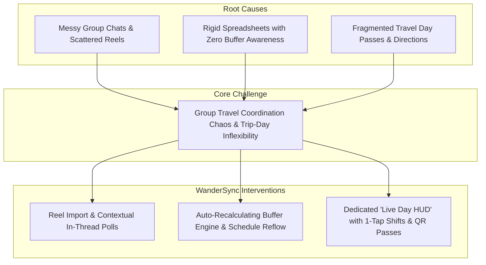
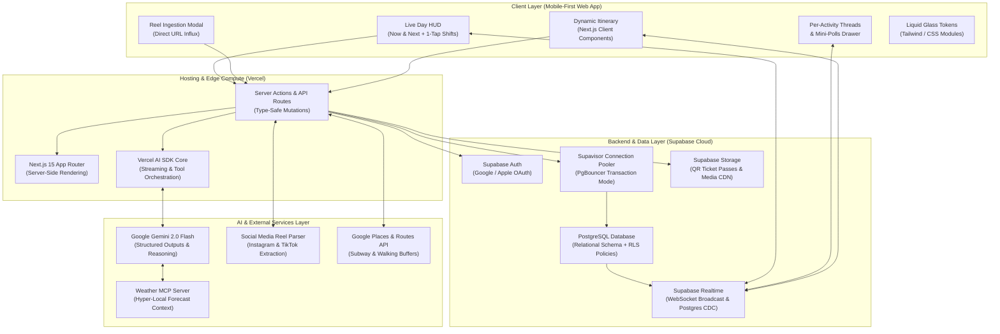
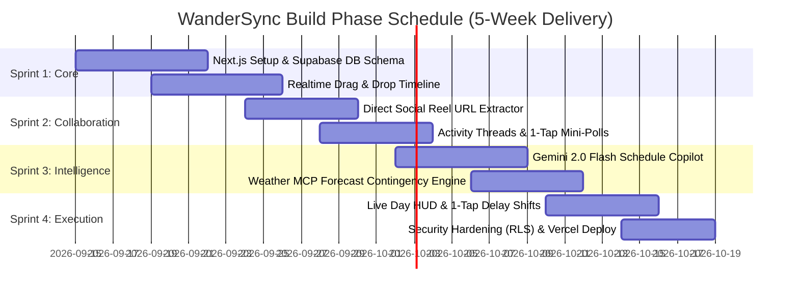

# WanderSync by WanderSync Team

**Team:** Clearence, Tony, Wei Gang  
**Problem Statement:** Travel Planner  
**Video Presentation:** [Unlisted Youtube Link]  
**Presentation Slides:** [Public Link]  

---

## 1. Project Overview

### The Problem
Coordinating group travel is plagued by communication chaos, fragile static schedules, and high execution stress on travel days. Group discussions and recommendations are fragmented across WhatsApp, Instagram DMs, and notes apps, causing links and agreements to get lost. When plans are finalized in static spreadsheets or rigid apps like TripIt and Wanderlog, they crumble upon the first delayed train or rainy afternoon because they lack real-time transit buffer intelligence. Existing tools either focus purely on flight confirmations (TripIt) without social consensus tools, or offer complex desktop-first spreadsheets (Wanderlog) that overwhelm travelers on mobile during active trip days.

### Our Solution
WanderSync is a mobile-first collaborative travel companion that unites real-time social idea capture, intelligent drag-and-drop scheduling, and high-focus day-of-trip execution. Travelers can import recommendations directly from Instagram Reels, vote on candidates via contextual per-activity mini-polls, and watch their itinerary automatically recalculate transit buffers. When delays happen or weather shifts, 1-tap schedule shifts and contingency reshuffling keep the group on track without friction.

**Core Feature Set:**
- **Dynamic Drag-and-Drop Itinerary:** Interactive time blocks with real-time transit buffer warnings and flexible day management (arbitrary trip dates with add/remove day controls).
- **Social Reel & Wishlist Influx:** Instant extraction of social media travel reels into a group discovery pool with spotlight badges and creator previews.
- **Contextual Activity Threads & Mini-Polls:** Anchored micro-discussions on specific venues with embedded voting that automatically commits winning options to the schedule.
- **Event Cancellation & Schedule Reflow:** Smart handling of cancellations allowing groups to either preserve a free-time pocket or reflow subsequent events forward.
- **Live Day HUD Mode:** A streamlined, zero-distraction day-of-trip dashboard displaying the current spot countdown, transit directions, entry QR passes, and 1-tap delay shifts (+30m / +1h).
- **Personalized Appearance & AI Copilot:** Customizable cover aesthetics and pace-tuning assistant for weather contingencies.

---

## 2. Ideation & Process

### 2.1 Ideas We Considered

| Idea | Why it was dropped / kept |
| :--- | :--- |
| **Interactive Drag-and-Drop Timeline with Buffer Warnings (Chosen)** | **Kept:** Solves the core failure of static spreadsheets by automatically checking whether walking or subway time between consecutive stops is physically realistic. |
| **Social Reels / TikTok Import & Wishlist (Chosen)** | **Kept:** Captures where travelers actually get their inspiration today, removing the tedious chore of manual data entry. |
| **Contextual Activity Discussion & Mini-Polls (Chosen)** | **Kept:** Eliminates endless WhatsApp debates by tying discussions directly to specific schedule slots and resolving ties via 1-tap voting. |
| **Dedicated "Live Day HUD" Execution Mode (Chosen)** | **Kept:** High cognitive overload on trip days requires a stripped-down interface showing only "Now & Next" with quick pass access. |
| **Tinder-Style Group Attraction Swiping** | **Dropped (Deferred):** Fun concept, but created decision fatigue for groups with diverging tastes and added unnecessary UI complexity to the MVP. |
| **Shared Multi-Currency Bill Splitter** | **Dropped (Deferred):** Excellent utility, but specialized expense tools (Splitwise) already dominate; focusing on schedule coordination delivered higher novel value. |
| **Split-Group Branching Schedules** | **Dropped (Deferred):** Over-complicated the timeline UI for casual weekend group getaways. Kept schedule unified with flexible free-time slots. |

### 2.2 Ideation Boards

*Ideation diagrams, problem trees, and user flow architectures will be placed here by the team.*

*Figure 2.1: Problem tree illustrating root causes and WanderSync core architectural interventions.*

*(Additional mindmaps, affinity diagrams, and scribble boards to be embedded during the submission phase)*

### 2.3 Mentor Consultation

| Date | Mentor | Feedback Received | What Was Changed |
| :--- | :--- | :--- | :--- |
| **05/09/2026** | Mentor Review 1 | Inquired about how we source travel data, handle unstructured inputs, and whether users would be forced into static templates. | Clarified the Reels/TikTok auto-extraction pipeline, and transitioned from hardcoded 3/5/7-day presets to flexible arbitrary calendar ranges with dynamic add/remove day controls. |
| **08/09/2026** | Mentor Review 2 | Main feedback was that the interface felt messy, with too many disparate tabs causing a fragmented demo flow. Advised combining similar views and hiding secondary items into the sidebar. | Consolidated navigation into a unified flow: merged Itinerary with Day HUD mode, anchored chat directly to itinerary cards & ideas, relocated AI preferences & cover customization to the sidebar, and built a dedicated progressive demo simulation. |
| **09/09/2026** | Mentor Review 3 | **1. Unnatural User Flow:** Navigating away from the main itinerary to separate discovery screens broke planning momentum. **2. Direct Reel Ingestion:** Recommended enabling travelers to import Instagram Reels / TikTok media directly on the Itinerary page without context switching. **3. Pitch Narrative Clarity:** Emphasized ensuring a seamless, easily grasped user flow during the strict 5-minute pitch without getting bogged down in secondary views. | • Added direct social media reel URL capture directly onto the Itinerary timeline via a quick-add spot action. • Streamlined the user journey into a single contiguous flow from inspiration to schedule insertion. • Structured the 5-minute pitch to follow a strict chronological storyline: Inspiration Influx → In-Line Consensus → Live Day Execution. |
| **11/09/2026** | Mentor Review 4 | **1. Dynamic Weather Adaptation (Weather MCP):** Recommended integrating a Weather Model Context Protocol (MCP) server so the AI can dynamically monitor forecasts and reschedule outdoor activities or swap trip dates. **2. Budget & Expense Tracking:** Inquired about how group travel costs and shared expenses are monitored across members. **3. Persona Alignment (Group vs. Solo):** Advised clarifying whether the product caters primarily to group consensus or solo planners. **4. Real-Time Delay Handling:** Challenged how users concretely react to schedule slippage and transit delays on travel days. **5. Full System Architecture:** Requested a comprehensive end-to-end system architecture diagram. **6. Pitch Hook & Video Outline:** Stressed following a structured 1-minute video opening that hooks judges immediately using a sharp problem statement and a relatable persona. | • Architected the Weather Reshuffle workflow powered by a Weather MCP tool abstraction that detects bad weather and proposes 1-tap schedule swaps. • Formally scoped shared budget/expense tracking into the project backlog while adding estimated cost indicators to activity cards. • Clarified target positioning: tailored for collaborative small groups (2–6 travelers) with single-lead orchestration. • Highlighted the "Live Day HUD" with 1-tap `+30m` / `+1h` delay shifts and automated transit buffer recalculation. • Integrated a comprehensive Full System Architecture Diagram in Section 5.1. • Restructured the presentation deck and video script to dedicate the opening 60 seconds exclusively to the persona and core pain points. |
| **12/09/2026** | Mentor Review 5 | Final rehearsal & pitch dry-run feedback (Consultation notes pending / in progress). | Formulated pre-submission rehearsal checklist, calibrated live demo timing to under 4 minutes, and confirmed responsive touch targets across mobile viewports. |

---

## 3. Design & Prototype

**UI Prototype:** [Public Link]

*(Check that it opens in an incognito window. Key screen mockups and interactive screenshots with captions will be added here by the team)*

- **Screen 1: Dynamic Itinerary & Buffer Guard** — *Caption: Chronological timeline with transit cushions and status indicators.*
- **Screen 2: Social Reel Spotlight & Wishlist** — *Caption: Extracted video content with visual source attribution.*
- **Screen 3: Contextual Discussion & Mini-Poll** — *Caption: Inline consensus voting resolving conflicting preferences.*
- **Screen 4: Live Day HUD Mode** — *Caption: Focused execution screen with 1-tap QR passes and schedule delay shifts.*

---

## 4. What Makes It Different

| Feature | WanderSync Twist | Existing Tools (TripIt / Wanderlog) |
| :--- | :--- | :--- |
| **Transit Buffer Engine** | Automatically detects when subway/walking cushion is inadequate and displays warning alerts in real time. | Static itineraries ignore real-world transit cushions, causing missed reservations. |
| **Social Media Native Influx** | Extracts hero venues directly from shared Instagram Reels and TikToks into a group proposal pool. | Requires manual copy-pasting of addresses and notes from social apps. |
| **Contextual Activity Polling** | Voting is tied directly to candidate cards; winning option instantly slots into the day's timeline. | Decisions happen in chat apps, requiring someone to manually transcribe the result to the plan. |
| **Contingency & Reflow Intelligence** | 1-tap `+30m` delay shifts and flexible cancellation (keep free-time pocket vs chronologically reflow). | Delaying one item requires manually updating every subsequent item's start/end time. |
| **Dedicated "Live Day HUD"** | Strips away planning clutter on travel day to display only the active venue, countdown, and pass. | Overwhelms travelers on mobile with dense spreadsheet grids while walking. |

---

## 5. Technical Architecture & Feasibility

> [!NOTE]
> **Prototype Validation vs. Production Build Phase:**  
> The current repository implementation serves as our rapid client-side prototype (Vanilla JS / Vite / LocalStorage simulation) engineered for immediate 60fps tactile validation, offline resilience, and interactive pitch delivery. The architecture outlined below details the production-ready, scalable stack that our team will implement during the formal **Building Phase**.

---

### 5.1 Production Tech Stack

| Layer | Technology | Why We Chose It | Constraints & How We Mitigate Them |
| :--- | :--- | :--- | :--- |
| **Frontend** | **Next.js 15 (App Router, React 19, TypeScript)** with Tailwind CSS & Apple Liquid Glass tokens | • Server Components (RSC) drastically minimize mobile JavaScript bundle size. • Built-in image optimization for high-density social media thumbnails and reel cards. • Dynamic route segmenting (`/trips/[id]/itinerary`, `/trips/[id]/hud`) enables instant deep linking for group members. | **Constraint:** Rapid drag-and-drop interactions can cause re-render latency in deep React component trees. **Mitigation:** Isolate time-block reordering to optimistic client state (`@hello-pangea/dnd`) with debounced commits to the backend. |
| **Backend & APIs** | **Next.js Route Handlers & Server Actions** + **Supabase Edge Functions** (Deno) | • Zero-overhead co-location of frontend views and server logic eliminates cross-origin latency. • End-to-end TypeScript type safety across queries and UI components. • Edge functions execute low-latency asynchronous tasks (webhook ingestion, proxying third-party APIs). | **Constraint:** Serverless function execution limits (10s–15s free-tier timeouts) during multi-step AI reasoning. **Mitigation:** Stream LLM responses using Vercel AI SDK and execute long-running scrapers as background worker jobs. |
| **Database** | **PostgreSQL** (Managed via **Supabase Cloud**) | • Strict relational data integrity (foreign keys cascade across `Trips` → `Days` → `ActivitySlots` → `PollVotes`). • Powerful JSONB support for storing rich, unstructured Instagram Reel metadata. • Row-Level Security (RLS) ensures bulletproof multi-tenant privacy (only authorized group members can read/write trip data). | **Constraint:** Serverless architectures easily exhaust PostgreSQL connection pools under concurrent load. **Mitigation:** Route all database traffic through the Supabase Transaction Pooler (**Supavisor** / PgBouncer over port 6543) with connection pooling. |
| **Real-Time Sync** | **Supabase Realtime** (Postgres CDC & Broadcast Channels) | • Delivers sub-100ms multi-user WebSocket synchronization without needing to manage a custom Node.js/Socket.io server. • Instant broadcast of timeline drag-and-drop movements, delay shifts, and poll voting to all active travelers. | **Constraint:** Potential message throttling and duplicate broadcast events upon reconnection. **Mitigation:** Implement optimistic local updates backed by client-side idempotency keys and sequence timestamps. |
| **AI Engine (LLM)** | **Google Gemini** (**Gemini 2.0 Flash** via `@google/genai` SDK & Vercel AI SDK) | • Industry-leading inference speed (sub-second Time-to-First-Token) crucial for dynamic schedule reflow. • Native multimodal processing capabilities to ingest and parse travel reel screenshots/stills. • Massive 1M+ token context window to ingest entire multi-day trip itineraries, transit guidelines, and chat histories. • Native support for Structured JSON outputs (`responseSchema`) and Function Calling (MCP). | **Constraint:** Rate limits (RPM/TPM) and potential network latency during on-the-go travel queries. **Mitigation:** Cache frequent destination queries in Supabase KV/Redis; enforce deterministic local buffer heuristics if the LLM request times out. |
| **APIs & Services** | • **Social Reel Extraction:** RapidAPI / Apify Instagram & TikTok Scraper • **Transit & Routing:** Google Places & Routes API (OSRM fallback) • **Weather Intelligence:** OpenWeatherMap API / Weather MCP Server • **Auth & Storage:** Supabase Auth (Google & Apple OAuth) + Supabase S3 Storage | • Extracted social data eliminates manual copy-pasting for travelers. • Google Routes provides authoritative subway and walking durations for transit buffers. • Weather MCP allows Gemini to dynamically detect adverse weather and recommend indoor slots. • Supabase Auth & Storage provide native mobile OAuth and secure ticket QR storage. | **Constraint:** Third-party API rate limits and recurring usage costs. **Mitigation:** Cache transit matrix times between major tourist landmarks in PostgreSQL; cache reel metadata for 48 hours; compress user ticket uploads to WebP (<200KB). |
| **Hosting & Infra** | **Vercel Edge Network** (Frontend & Server Actions) + **Supabase Cloud** (Tokyo/Singapore Region) | • Global edge CDN provides sub-50ms TTFB worldwide. • Geographically colocated database servers (APAC) ensure low-latency queries (<30ms round-trip) for Southeast Asia and Japan travel hubs. • Zero server maintenance overhead during development. | **Constraint:** Edge bandwidth and compute quotas on free/starter tiers. **Mitigation:** Aggressive cache headers (`stale-while-revalidate`), static asset pre-rendering, and Incremental Static Regeneration (ISR) for public itineraries. |

---

### 5.2 System Architecture Diagram

*Figure 5.1: WanderSync production architecture showing Next.js App Router, Supabase backend, Gemini 2.0 Flash, and external API integrations.*

---

### 5.3 Build Plan & Scope

To ensure rapid delivery, architectural stability, and a polished user experience, our team is pursuing a **disciplined, tightly scoped build plan**. Rather than building an unfocused MVP with half-finished utilities, we focus exclusively on the core collaborative travel lifecycle: **Inspire → Consensual Planning → Frictionless Day-of Execution**.

#### In-Scope Deliverables (The High-Value Core)

1. **Sprint 1: Collaborative Data Core & Real-Time Itinerary (Weeks 1–2)**
   - Initialize Next.js 15 App Router with TypeScript and Tailwind CSS.
   - Design and migrate the Supabase PostgreSQL relational schema (`trips`, `days`, `activities`, `collaborators`, `polls`) protected by Row-Level Security (RLS).
   - Implement real-time drag-and-drop timeline with Supabase Realtime broadcast channels, featuring optimistic UI reordering and automatic chronological time recalculations.
   - Deploy deterministic client-side Transit Buffer Engine providing visual buffer warnings when transit gaps are insufficient.

2. **Sprint 2: Social Reel Influx & In-Timeline Consensus (Week 3)**
   - Implement direct Instagram/TikTok Reel link parser endpoint caching spot titles, geo-tags, and thumbnails directly to the itinerary quick-add drawer.
   - Deliver contextual per-activity micro-threads and embedded mini-polls; resolving a poll automatically commits the winning activity to the schedule via Server Actions.

3. **Sprint 3: Gemini 2.0 AI Assistant & Weather MCP Integration (Week 4)**
   - Integrate Google Gemini 2.0 Flash using structured outputs (`responseSchema`) for prompt-based pace tuning (*Chill*, *Balanced*, *Turbo*).
   - Connect the Weather MCP server to monitor 48-hour forecast alerts, generating 1-tap accept proposals to swap outdoor activities with indoor fallbacks.

4. **Sprint 4: "Live Day HUD" Execution & Production Deployment (Week 5)**
   - Build the stripped-down, high-contrast Day-of-Trip HUD mode displaying current spot countdown, next transit line, offline-cached ticket passes, and 1-tap `+30m` / `+1h` delay shifts.
   - Implement dual cancellation handling (free-time pocket vs. schedule reflow).
   - Conduct load testing on Supavisor connection pooling, audit RLS rules, and deploy production build to Vercel Edge.

#### Explicitly Deferred Out-of-Scope Items (Disciplined Prioritization)
The following secondary concepts are intentionally deferred to future iterations to preserve delivery focus:
- **Shared Multi-Currency Bill Splitter**: Mature third-party solutions (Splitwise) already dominate; focusing on schedule coordination delivers higher novel value.
- **Branching Split-Group Schedules**: Managing diverging group sub-branches adds unnecessary cognitive overhead; flexible free-time slots achieve the same outcome with simpler UX.
- **Native iOS/Android App Store Packaging**: The mobile-first responsive PWA delivers native-like 60fps fluidity via the browser without app store review delays.
